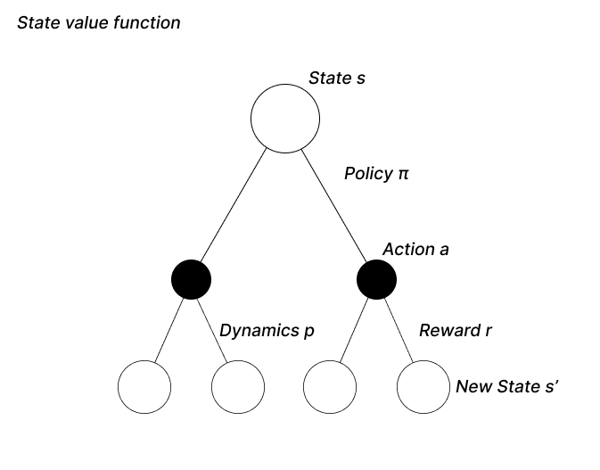
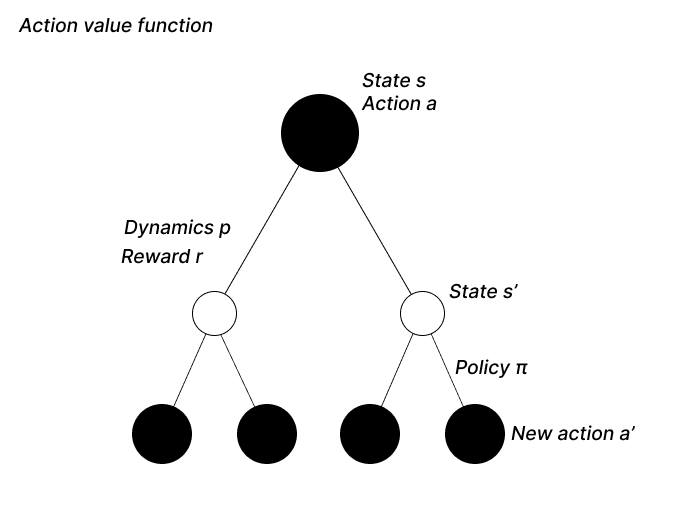

In the previous articles, we had a look at the general setting of an RL problem by understanding the importance of the Markov property, the notion of rewards and return. Now that the agent evolves in a well defined environment and can receive rewards, we want to find a way to solve the MDP, in other words to maximize the expected return.

## ***Policy:***

To maximize the return, we need our agent to pick the best possible actions from every state. You might wonder, how does the agent select actions ?
The answer is pretty straightforward, the agent follows a ***policy*** $\pi$, which is a **probability distribution over all actions in a given state**. Simply put, the policy is a **function that assigns a probability to each available action at a specific point in time**. The probability of picking an action $a$ in state $s$ is given by:
$$\pi(a|s)$$
As $\pi$ is a probability distribution, the sum of all action probabilities is 1:
$$\sum_{a \in \mathcal{A(s)}}\pi(a|s) = 1$$
Finding the best policy is equivalent to maximizing the expected return, therefore, we need a way to determine how good it is to follow a specific policy.

## ***Value functions:***

Value functions allow us to get an idea of how valuable it is to pursue a specific policy in a certain state. Here, we'll introduce the ***state value function*** and the ***action value function***:

### ***State value function:***

The state value function helps to answer the questions:

***How good is it to be in state $s$ and to follow the policy $\pi$ thereafter ?***

In an MDP, the state value function is defined as follows:
$$v_\pi(s) = E_\pi[G_t|S_t=s]$$
As you can see, the state value function is the expected return given that we are in state $s$ and follow the policy $\pi$. We can use the definition of the return to obtain the following form:
$$v_\pi(s) = E_\pi[\sum_{k=0}^\infty \gamma^kR_{t+k+1}|S_t=s]$$

### ***ction value function:***

On the other hand, the action value function answers :

***How good is it to be in state $s$, pick action $a$ and follow the policy $\pi$ thereafter ?***

In an MDP, the action value function is defined as follows:
$$q_\pi(s) = E_\pi[G_t|S_t=s, A_t = a]$$
This equation is highly similar to the state value function, the only difference is that, before following $\pi$, we pick an action $a$.
$$q_\pi(s) = E_\pi[\sum_{k=0}^\infty \gamma^kR_{t+k+1}|S_t=s, A_t=a]$$

## ***Bellman equations:***

Now that we have briefly defined value functions, we will introduce the Bellman equations, that are directly derived from the state value and action value functions. These equations are used to link the value of each state, or state-action pair to the value of its possible successors.

### ***The V function:***

To solve an MDP, we need to evaluate the values of states based on the actions and subsequent states available. The Bellman equation allows us to define the state value function using recursion, which will come in handy and allow us to iterate through the state space.
Let's start from the definition of the state value function:
$$v_\pi(s) = E_\pi[G_t|S_t=s]$$
Using the recursive definition of $G_t$, we obtain:
$$v_\pi(s) = E_\pi[R_{t+1} + \gamma G_{t+1}|S_t=s]$$
We'll now decompose the expectation as three sums, one over each available actions $a$, over each subsequent state $s'$ and rewards $r$ (look at the following backup graph for a more visual explanation !):
$$v_\pi(s) = \sum_a\pi(a|s)\sum_{s',r}p[s',r|s,a](r + \gamma E_{\pi}[G_{t+1}|S_{t+1}=s')]$$
Here you might recognize that $E_{\pi}[G_{t+1}|S_{t+1}=s']$ is the value of the state s', therefore:
$$v_\pi(s) = \sum_a\pi(a|s)\sum_{s',r}p[s',r|s,a](r + \gamma v_\pi(s'))$$
For  all state $s \in \mathcal{S}$

*Note that $\sum_{s',r}$ is a compact notation for $\sum_{s'}\sum_r$*

***Visual explanation:***

This might seem complicated, but no worries, let's look at a more visual explanation with this backup diagram. We start in a state $s$ and want to estimate the value of being in this state. From there we can pick different actions, each action has a probability of being picked depending on the policy $\pi$ (remember that the policy is a probability distribution). After picking an action, the environment will return a new state $s'$ and a reward $r$, both are subject to the environment's dynamics $p$ which is also a probability distribution.
The Bellman equation states that the value of being in state $s$ is the sum of the rewards and subsequent state values we can get from picking an action $a$ while being in state $s$ : $$[r + \gamma v_\pi(s')]$$This sum is weighted by the probability of obtaining each action, reward and state triplet:
$$ \sum_a\pi(a|s)\sum_{s',r}p(s',r|s,a)$$
Putting it all together, we obtain the Bellman equation for the state value.

### ***The Q function:***

In the same fashion, we can derive the Bellman version of the action-value function starting from the definition:
$$q_\pi(s) = E_\pi[G_t|S_t=s, A_t=a]$$
However this time, we start from a state $s$ ***and*** take an action $a$ (refer to the following backup diagram). As the action we chose is fixed, the policy is not yet intervening. Using the same recursive property og $G_t$, we obtain:
$$q_\pi(s) = \sum_{s',r} p[s',r|s,a](r + \gamma E_\pi[G_{t+1}|S_{t+1}=s')]$$
We now have the expected return for states $s'$, however we are interested in the value of *state-action pairs*. We can therefore use the following transformation and introduce the new action $a'$ and its probability defined by $\pi$: $$\gamma E_\pi[G_{t+1}|S_{t+1}=s'] = \gamma \sum_{a'} \pi(a'|s')E_\pi[G_{t+1}|S_{t+1}=s', A_{t+1}=a']$$ We effectively transformed the state value of $s'$ into the action value of $s'$, following the definition of  $q_{\pi}$, the whole expression becomes:
$$q_\pi(s) = \sum_{s',r} p[s',r|s,a](r + \gamma \sum_{a'} \pi(a',s') q_\pi(a',s'))$$

***Visual explanation:***

This time, we start from a state $s$ and pick an action $a$, from there we can transition to different states $s'$ and receive a reward $r$ depending on the environment's dynamics. As we evaluate all the possible transitions, we get the term $\sum_{s',r} p(s',r|s,a)$.
We then want to estimate the value of the new state $s'$ we landed in. This value corresponds to the transition reward $r$ summed with the (discounted) expected return from state $s'$.
The expected return from state $s'$ can be seen as the weighted sum of the values of each state-action pairs, with the weight being the probability of picking action $a'$ from state $s'$. This is summarized by the term: $\gamma \sum_a \pi(a',s') q_\pi(a',s')$

Put together, we obtain the Bellman equation for the action value.

## ***Optimal policies and value functions:***

### ***Comparing policies:***

One of the main reasons for introducing value functions is to be able to compare policies, and therefore search for an optimal policy: a policy for which the value is maximal in each state.
Consider two policies $\pi$ and $\pi'$:
$$\pi \geq \pi' \implies v_\pi(s) \geq v_{\pi'}(s)\text{ } \forall s \in \mathcal{S}$$
$\pi$ is superior or equal to $\pi'$ if and only if the value of any state $s$ under $\pi$ is superior or equal to the value of state $s$ under $\pi'$.
A policy that is superior or equal to all other policies is called an ***optimal policy*** and is noted $\pi_{\star}$.
In fact, there is always at least one optimal policy, therefore $\pi_{\star}$ refers to any optimal policy.

Why is that ? Imagine two policies $\pi_1$ and $\pi_2$, whith $\pi_1>\pi_2$ in a certain state A and $\pi_1<\pi_2$ in another state B. It is possible to create a policy $\pi_3$ as a combination of both previous policies so that $\pi_3$ always follows the policy with the highest value in the current state. Therefore, $\pi_3$ will necessarily have a value superior or equal to both policies in every state.
There exists a formal proof to this problem, however this argument helps us understand that we will not ***encounter situations where we have to sacrifice value in one state to achieve value in another***, and therefore there exist a policy that is best in every state.

### ***Optimal value functions:***

Using an optimal policy $\pi_{\star}$, we can define the optimal value functions $v_\star$ and $q_\star$.
The state value function for an optimal policy has the greatest value in each state, it can be defined as follows:
$$v_{\pi \star}(s) = E_{\pi \star}[G_t|S_t=s] = \max_{\pi} v_\pi(s) \text{ for all } s \in \mathcal S$$
In other words $v_{\pi \star}(s)$ is the equal to the maximum value over all policies.

Optimal policies also share the same action value function, given by:
$$q_{\pi\star}(s,a) = \max_\pi q_\pi(s,a) \text{ for all } s \in \mathcal S \text{ and } a \in \mathcal A$$

### ***Bellman optimality equations:***

The Bellman equations for optimal state and action value functions are called the Bellman optimality equations.
Let's recall the Bellman equation for the state value function and substitute the policy $\pi$ by an optimal policy $\pi_\star$:
$$v_\star(s) = \sum_a\pi_\star(a|s)\sum_{s',r}p[s',r|s,a](r + \gamma v_{\star}(s'))$$
Now, as $\pi_\star$ is an optimal policy, we can rewrite the equation in a form that doesn't reference the policy. Indeed, the optimal policy select the best action in every state by assigning probability 1 to the action yielding maximal value and 0 to the others. This can be expressed by replacing $\pi_\star$ by the maximum over all actions:
 $$v_\star(s) = \max_a\sum_{s',r}p[s',r|s,a](r + \gamma v_\star(s'))$$

We can apply the same reasoning to $q_\star$:
$$q_\star(s) = \sum_{s',r} p[s',r|s,a](r + \gamma \sum_{a'} \pi_\star(a',s') q_\star(a',s'))$$
$$q_\star(s) = \sum_{s',r} p[s',r|s,a](r + \gamma \max_{a'} q_\star(a',s'))$$

## ***Finding an optimal policy from an optimal value function:***

To conclude this chapter, we'll derive a formula for the optimal policy based on optimal value functions.

### ***From $v_\star$:***

Having access to the dynamics function $p$ and the optimal state value function $v_\star$ makes it easy to determine $\pi_\star$. Indeed, for every state, we'll compute the term $\sum_{s',r}p[s',r|s,a](r + \gamma v_\star(s'))$  for each action. This can be seen as a one-step lookahead, as depicted on the backup diagram.
For some actions, this term will reach a maximum, a deterministic policy selecting these actions for each state will necessarily be optimal.
Now let's see how to derive $\pi_\star$ from $v_\star$:
$$v_\star(s) = \max_a\sum_{s',r}p[s',r|s,a](r + \gamma v_\star(s'))$$
Recall that $v_\star$ simply returns the maximal value for state $s$, the optimal policy picks the action associated with this maximum value. Therefore, we just have to replace the $\max$ operator by $argmax$:
$$\pi_\star(s) = \text{arg}\max_a\sum_{s',r}p[s',r|s,a](r + \gamma v_\star(s'))$$

### ***From $q_\star$:***

If instead we have access to $q_\star$, deriving $\pi_\star$ is even easier. We only have to select the action $a$ that maximizes $q_\star(s,a)$.

$$\pi_\star(s) = \text{arg}\max_a \text{ }q_\star(s,a)$$

## ***Wrapping up:***

In conclusion, the Bellman equation is a fundamental concept in the field of Reinforcement Learning, enabling us to ***compute the optimal value function of an agent in a Markov Decision Process***. Through the use of the Bellman equation, we can efficiently solve complex decision-making problems by breaking them down into smaller sub-problems.

In the next article, we will dive deeper into the world of  <a href="../">Dynamic Programming<a/> algorithms, a class of algorithms that utilizes the Bellman equation to solve problems in a systematic and efficient manner. We will explore various dynamic programming algorithms such as Value Iteration and Policy Iteration, and see how they can be used to solve larger and more complex decision-making problems.
