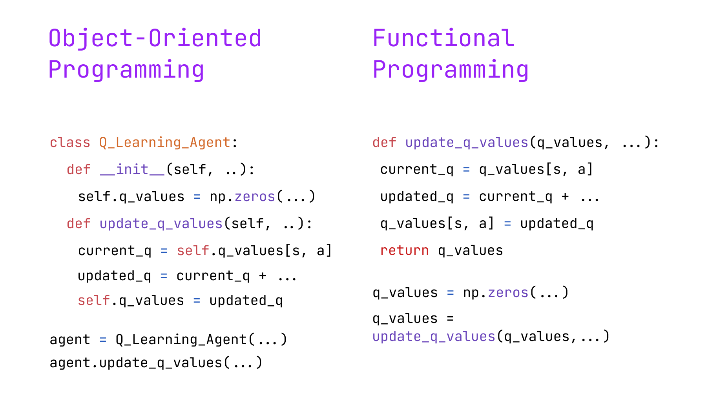
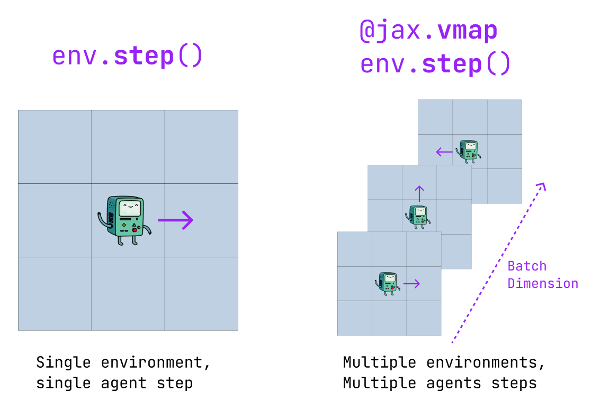
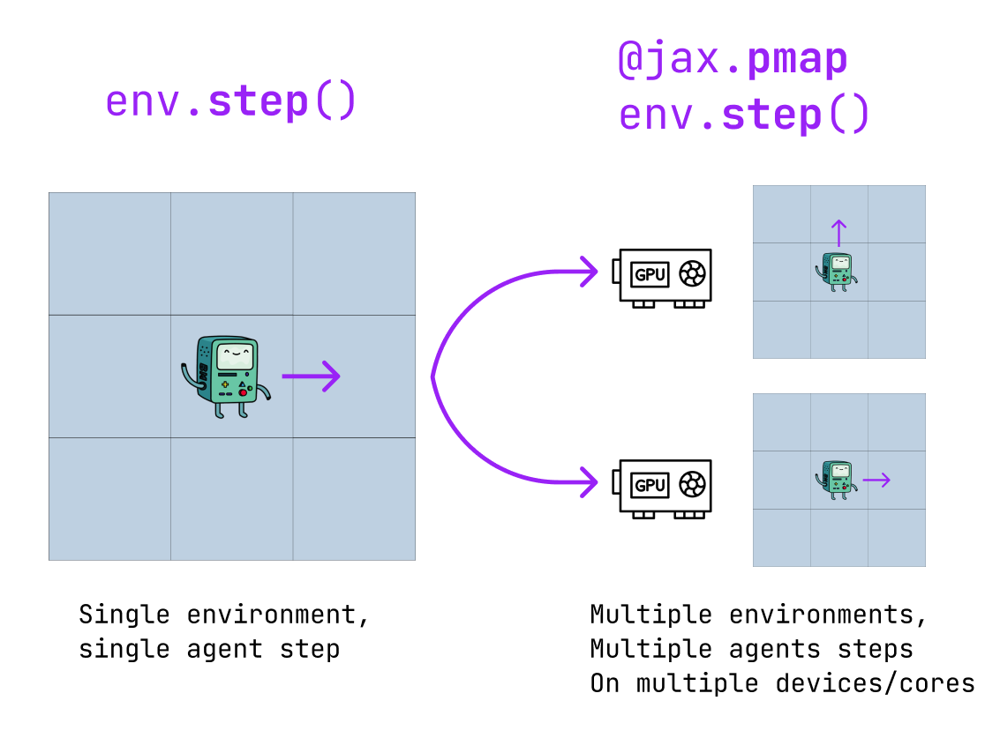
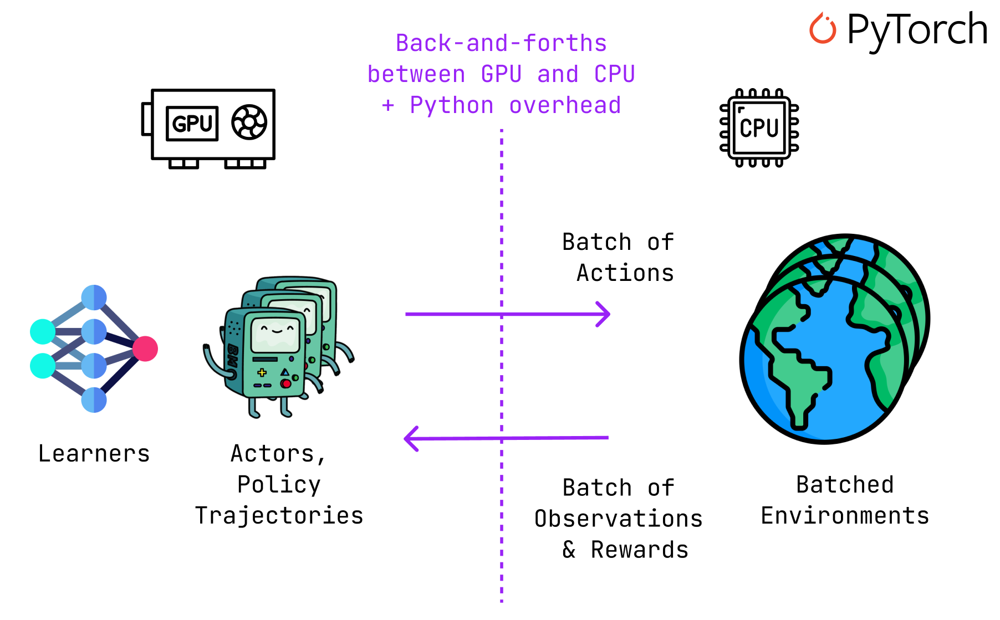
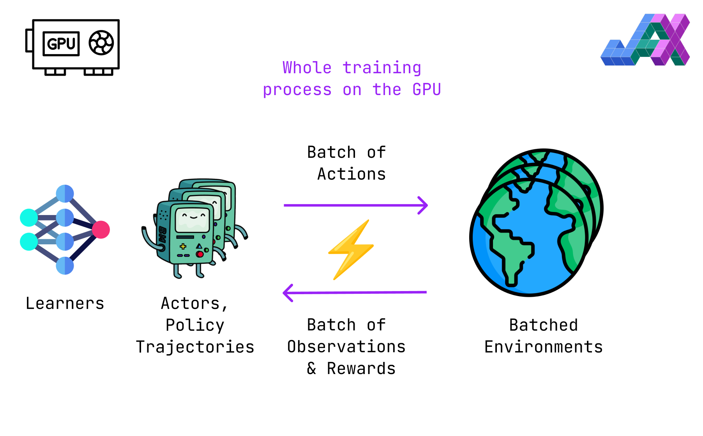
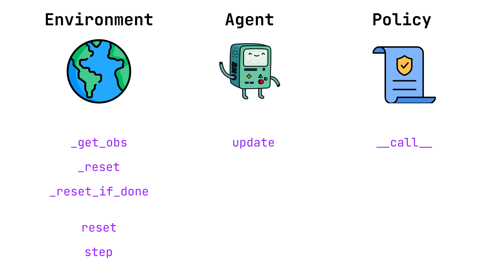
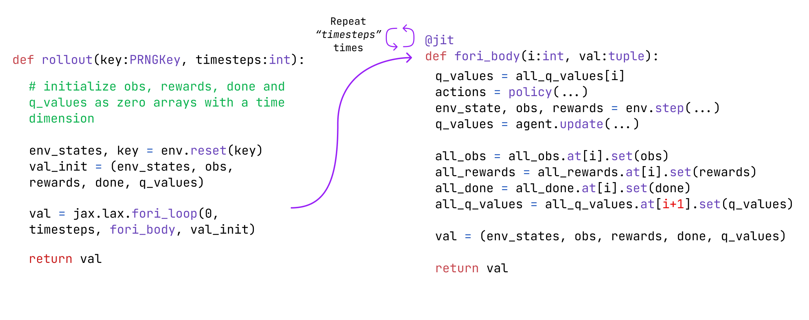

> 🥳 ***This article got published on Towards Data Science  !*** If you enjoy it, feel free to follow me on Medium and upvote the article [here](https://medium.com/towards-data-science/vectorize-and-parallelize-rl-environments-with-jax-q-learning-at-the-speed-of-light-49d07373adf5), thank you and have a  nice read ! 🥳

In the previous article, we introduced [**Temporal-Difference Learning**](https://medium.com/towards-data-science/temporal-difference-learning-and-the-importance-of-exploration-an-illustrated-guide-5f9c3371413a) and particularly **Q-learning**, in the context of a GridWorld.

While this implementation served the purpose of demonstrating the differences in performances and exploration mechanisms of these algorithms, ***it was painfully slow***.

Indeed, the environment and agents were mainly coded in Numpy, which is by no means a standard in RL, even though it makes the code easy to understand and debug.

In this article, we'll see how to scale up RL experiments by vectorizing environments and seamlessly parallelizing the training of dozens of agents using JAX. In particular, this article covers:

- JAX basics and useful features for RL
- Vectorized environment and why they are so fast
- Implementation of an environment, policy, and Q-learning agent in JAX
- Single-agent training
- How to parallelize agent training, and how easy it is!

All the code featured in this article is available on [***GitHub***](https://github.com/RPegoud/jax_rl) :

<div align="center">
    <a href="https://github.com/RPegoud/jax_rl"></a>
</div>
---

## JAX Basics

JAX is *yet another* Python Deep Learning framework developed by Google and widely used by companies such as DeepMind.
> *"JAX is Autograd (automatic differenciation) and XLA (Accelerated Linear Algebra, a TensorFlow compiler), brought together for high-performance numerical computing."* - Official Documentation

<div align="center">
    
</div>

As opposed to what most Python developers are used to, JAX doesn't embrace the **object-oriented programming (OOP)** paradigm, but rather **functional programming (FP)**.

Put simply, it relies on **pure functions** (deterministic and without side effects) and **immutable data structures** (instead of changing the data in place, new data structures are created with the desired modifications) as primary building blocks. As a result, FP encourages a more functional and mathematical approach to programming, making it well-suited for tasks like numerical computing and machine learning.

Let's illustrate the differences between those two paradigms by looking at pseudocode for a **Q-update function**:



- The **object-oriented** approach relies on a **class instance** containing various **state variables** (such as the Q-values). The update function is defined as a class method that updates the internal state of the instance.

- The **functional programming** approach relies on a **pure function**. Indeed, this Q-update is **deterministic** as the Q-values are passed as an argument. Therefore, any call to this function with the **same inputs** will result in the **same output**s whereas a class method's outputs may depend on the internal state of the instance. Also, data structures such as arrays are defined and modified in the **global scope**.

As such, JAX offers a variety of function decorators that are particularly useful in the context of RL:

- **vmap** (vectorized map): Allows a function acting on a single sample to be applied on a batch. For instance, if env.step() is a function performing a step in a **single environment**, vmap(env.step)() is a function performing a step in **multiple environments**. In other words, vmap adds a **batch dimension** to a function.



- **jit** (just-in-time compilation): Allows JAX to perform a *"Just In Time compilation of a JAX Python function"* making it **XLA-compatible**. Essentially, using jit allows us to **compile functions** and provides significant **speed improvements** (in exchange for some additional overhead when first compiling the function).

- **pmap** (parallel map): Similarly to vmap, pmap enables **easy parallelization**. However, instead of adding a batch dimension to a function, it **replicates** the function and executes it on **several XLA devices**. *Note: when applying pmap, jit is also applied automatically.*



Now that we have laid down the basics of JAX, we'll see how to obtain massive speed-ups by vectorizing environments.

## Vectorized Environments

First, what is a vectorized environment and what problems does vectorization solve?

In most cases, RL experiments are **slowed down by CPU-GPU data transfers**. Deep Learning RL algorithms such as Proximal Policy Optimization (PPO) use **Neural Networks** to **approximate the policy**.

As always in Deep Learning, Neural Networks use **GPUs** at training and inference time. However, in most cases, environments run on the **CPU** (even in the case of multiple environments being used in parallel).

This means that the usual RL loop of selecting actions via the policy (Neural Networks) and receiving observations and rewards from the environment requires constant back-and-forths between the GPU and the CPU, which **hurts performance**.

In addition, using frameworks such as PyTorch without "jitting" might cause some overhead, since the GPU might have to **wait for Python** to send back observations and rewards from the CPU.



On the other hand, JAX enables us to easily run batched environments on the GPU, removing the friction caused by GPU-CPU data transfer.
Moreover, as jit compiles our JAX code to XLA, the execution is no longer (or at least less) affected by the inefficiency of Python.



For more details and exciting applications to **meta-learning RL research**, I highly recommend this blog post by Chris Lu:

<blockquote align="center" class="twitter-tweet"><p lang="en" dir="ltr">1/ 🚀 Presenting PureJaxRL: A game-changing approach to Deep Reinforcement Learning! We achieve over 4000x training speedups in RL by vectorizing agent training on GPUs with concise, accessible code.<br><br>Blog post: <a href="https://t.co/MjWisJWNTg">https://t.co/MjWisJWNTg</a><br>🧵 <a href="https://t.co/pSIgB9VmKz">pic.twitter.com/pSIgB9VmKz</a></p>&mdash; Chris Lu (@_chris_lu_) <a href="https://twitter.com/_chris_lu_/status/1643992216413831171?ref_src=twsrc%5Etfw">April 6, 2023</a></blockquote> <script async src="https://platform.twitter.com/widgets.js" charset="utf-8"></script>

## Environment, Agent, and Policy implementations

Let's take a look at the implementation of the different parts of our RL experiment. Here's a high-level overview of the basic functions we'll need:



### The environment

This implementation follows the scheme provided by Nikolaj Goodger in his great article on [writing environments in JAX](https://medium.com/@ngoodger_7766/writing-an-rl-environment-in-jax-9f74338898ba).

Let's start with a **high-level view** of the environment and its methods. This is a general plan for implementing an environment in JAX:

<script src="https://gist.github.com/RPegoud/94a922d960fd5d3e5fb1ebaff5cc6dbd.js"></script>

Let's take a closer look at the class methods *(as a reminder, functions starting with "_" are private and shall not be called outside of the scope of the class)*:

- **_get_obs**: This method converts the environment state to an observation for the agent. In a partially observable or stochastic environment, the processing functions applied to the state would go here.
- **_reset**: As we'll be running multiple agents in parallel, we need a method for individual resets on the completion of an episode.
- **_reset_if_done**: This method will be called at each step and trigger *_reset* if the *"done*" flag is set to True.
- **reset**: This method is called at the beginning of the experiment to get the initial state of each agent, as well as the associated random keys
- **step**: Given a state and an action, the environment returns an observation (new state), a reward, and the updated "done" flag.

In practice, a generic implementation of a GridWorld environment would look like this:

<script src="https://gist.github.com/RPegoud/13dd809c6d88dd4dce3de49617326597.js"></script>

Notice that, as mentioned earlier, all class methods follow the **functional programming paradigm**. Indeed, we **never update the internal state** of the class instance. Furthermore, the class attributes are all **constants** that won't be modified after instantiation.

Let's take a closer look:

- **init**: In the context of our GridWorld, the available actions are [0, 1, 2, 3]. These actions are translated into a 2-dimensional array using self.movements and added to the state in the step function.
- **_get_obs**: Our environment is deterministic and fully observable, therefore the agent receives the state directly instead of a processed observation.
- **_reset_if_done**: The argument env_state corresponds to the (state, key) tuple where key is a jax.random.PRNGKey. This function simply returns the initial state if the done flag is set to True, however, we cannot use conventional Python control flow within JAX jitted functions. Using jax.lax.cond we essentially get an expression equivalent to:

```python
def cond(condition, true_fun, false_fun, operand):
  if condition: # if done flag == True
    return true_fun(operand)  # return self._reset(key)
  else:
    return false_fun(operand) # return env_state
```

- **step**: We convert the action to a movement and add it to the current state *(jax.numpy.clip ensures that the agent stays within the grid)*. We then update the *env_state* tuple before checking if the environment needs to be reset. As the step function is used frequently throughout training, jitting it allows significant performance gains. The ***@partial(jit, static_argnums=(0, )*** decorator signals that the "self" argument of the class method should be considered **static**. In other words, the class **properties are constant** and won't change during successive calls to the step function.

## Q-Learning Agent

The Q-learning agent is defined by the **update** function, as well as a static **learning rate** and **discount factor**.

<script src="https://gist.github.com/RPegoud/d19c5c754fe77ad0fecd27525963287d.js"></script>

Once again, when jitting the update function, we pass the *"self"* argument as static. Also, notice that the *q_values* matrix is modified in place using *set()* and its value is not stored as a class attribute.

## Epsilon-Greedy Policy

Finally, the policy used in this experiment is the standard **epsilon-greedy** policy. One important detail is that it uses **random tie-breaks**, which means that if the maximal Q-value is not unique, the action will be sampled uniformly from the maximal Q-values (using argmax would always return the first action with maximal Q-value).

This is especially important if Q-values are initialized as a matrix of zeros, as the action 0 (move right) would always be selected.
Otherwise, the policy can be summarized by this snippet:

```python
action = lax.cond(
            explore, # if p < epsilon
            _random_action_fn, # select a random action given the key
            _greedy_action_fn, # select the greedy action w.r.t Q-values
            operand=subkey, # use subkey as an argument for the above funcs
        )
return action, subkey
```

Note that when we use a **key** in JAX (e.g. here we sampled a random float and used random.choice) it is common practice to split the key afterwards (i.e. "move on to a new random state", more details here).

## Single-agent training loop

Now that we have all the required components, let's train a single agent.

Here's a Pythonic training loop, as you can see we are essentially selecting an action using the policy, performing a step in the environment, and updating the Q-values, until the end of an episode. Then we repeat the process for N episodes. As we'll see in a minute, this way of training an agent is quite inefficient, however,  it summarizes the key steps of the algorithm in a readable way:

<script src="https://gist.github.com/RPegoud/ecb49bdae8c6c7232b9362550eaba8b8.js"></script>

On a single CPU, we complete 10.000 episodes in 11 seconds, at a rate of 881 episodes and 21 680 steps per second.

```bash
100%|██████████| 10000/10000 [00:11<00:00, 881.86it/s]
Total Number of steps: 238 488
Number of steps per second: 21 680
```

Now, let's replicate the same training loop using JAX syntax. Here's a high-level description of the rollout function:



To summarize, the rollout function:

- **Initializes** the observations, rewards, and done flags as empty arrays with a dimension equal to the number of time steps using jax.numpy.zeros. The Q-values are initialized as an empty matrix with shape [timesteps+1, grid_dimension_x, grid_dimension_y, n_actions].
- Calls the *env.reset()* function to get the initial state
- Uses the ***jax.lax.fori_loop()*** function to call a ***fori_body()*** function N times, where N is the timestep parameter

The *fori_body()* function behaves similarly to the previous Python loop. After selecting an action, performing a step, and computing the Q-update, we update the obs, rewards, done, and q_values arrays in place (the Q-update targets the time step **t+1**).

<script src="https://gist.github.com/RPegoud/ceafd65d2cd0aee48101bead23080b00.js"></script>

This additional complexity leads to an **85x speed-up**, we now train our agent at roughly **1.83 million steps per second**. Note that here, the training is done on a ***single CPU*** as the environment is simplistic.

However, **end-to-end vectorization scales even better** when applied to complex environments and algorithms benefitting from **multiple GPUs** (Chris Lu's article reports a whopping **4000x speed-up** between a CleanRL PyTorch implementation of PPO and a JAX reproduction).

```bash
100%|██████████| 1000000/1000000 [00:00<00:00, 1837563.94it/s]
Total Number of steps: 1 000 000
Number of steps per second: 1 837 563
```

After training our agent, we plot the maximal Q-value for each cell (i.e. state) of the GridWorld and we observe that it has effectively learned to go from the initial state (bottom right corner) to the objective (top left corner).

<iframe width="500" height="400" frameborder="0" scrolling="no" src="//plotly.com/~Ryan_pgd/1.embed"></iframe>

# Parallel agents training loop

As promised, now that we've written the functions required to train a single agent, we have little to no work left to train multiple agents in parallel on batched environments!

Thanks to vmap we can quickly transform our previous functions to work on batches of data. We only have to specify the expected input and output shapes, for instance for env.step:

- **in_axes** = ((0,0), 0) represents the input shape, which is composed of the env_state tuple (dimension (0, 0)) and an observation (dimension 0).
- **out_axes** = ((0, 0), 0, 0, 0) represents the output shape, with the output being ((env_state), obs, reward, done).
- Now, we can call ***v_step*** on an **array** of *env_states* and *actions* and receive an **array** of processed *env_states*, *observations*, *rewards*, and *done flags*.
- Note that we also **jit** all batched functions for performance (arguably, jitting *env.reset()* is unnecessary given that it is only called once in our training function).

<script src="https://gist.github.com/RPegoud/6b4008db31bd1521c8ee0c5850d9f32b.js"></script>

The last adjustment we have to make is to **add a batch dimension** to our arrays to account for each agent's data.

By doing this, we obtain a function that allows us to train **multiple agents in parallel**, with minimal adjustments compared to the single agent function:

<script src="https://gist.github.com/RPegoud/914062719162b4230abf28987da1b3d5.js"></script>

We get similar performances with this version of our training function:

```bash
100%|██████████| 100000/100000 [00:02<00:00, 49036.11it/s]
Total Number of steps: 100 000 *30 = 3 000 000
Number of steps per second: 49 036* 30 = 1 471 080
```

---

And that's it! Thanks for reading this far, I hope this article provided a helpful introduction to implementing vectorized environments in JAX.
If you enjoyed the read, please consider sharing this article and starring my GitHub repository, thanks for your support! 🙏

Finally, for those interested in digging a little deeper, here's a list of useful resources that helped me get started with JAX and redacting this article:

## A curated list of awesome JAX articles and resources

- [1] **Coderized**, (functional programming) [*The purest coding style, where bugs are near impossible*](https://www.youtube.com/watch?v=HlgG395PQWw&t=254s), YouTube
- [2] **Aleksa Gordić**,  [*JAX From Zero to Hero YouTube Playlist*](https://www.youtube.com/watch?v=SstuvS-tVc0&list=PLBoQnSflObckOARbMK9Lt98Id0AKcZurq) (2022), The AI Epiphany
- [3] **Nikolaj Goodger**, [*Writing an RL Environment in JAX*](https://medium.com/@ngoodger_7766/writing-an-rl-environment-in-jax-9f74338898ba) (2021)
- [4] **Chris Lu**, [*Achieving 4000x Speedups and Meta-Evolving Discoveries with PureJaxRL*](https://chrislu.page/blog/meta-disco/) (2023), [University of Oxford](https://www.ox.ac.uk), Foerster Lab for AI Research
- [5] **Nicholas Vadivelu**, [*Awesome-JAX*](https://github.com/n2cholas/awesome-jax) (2020), a list of JAX libraries, projects, and resources
- [6] **JAX Official Documentation**, [Training a Simple Neural Network, with PyTorch Data Loading](https://jax.readthedocs.io/en/latest/notebooks/Neural_Network_and_Data_Loading.html)
