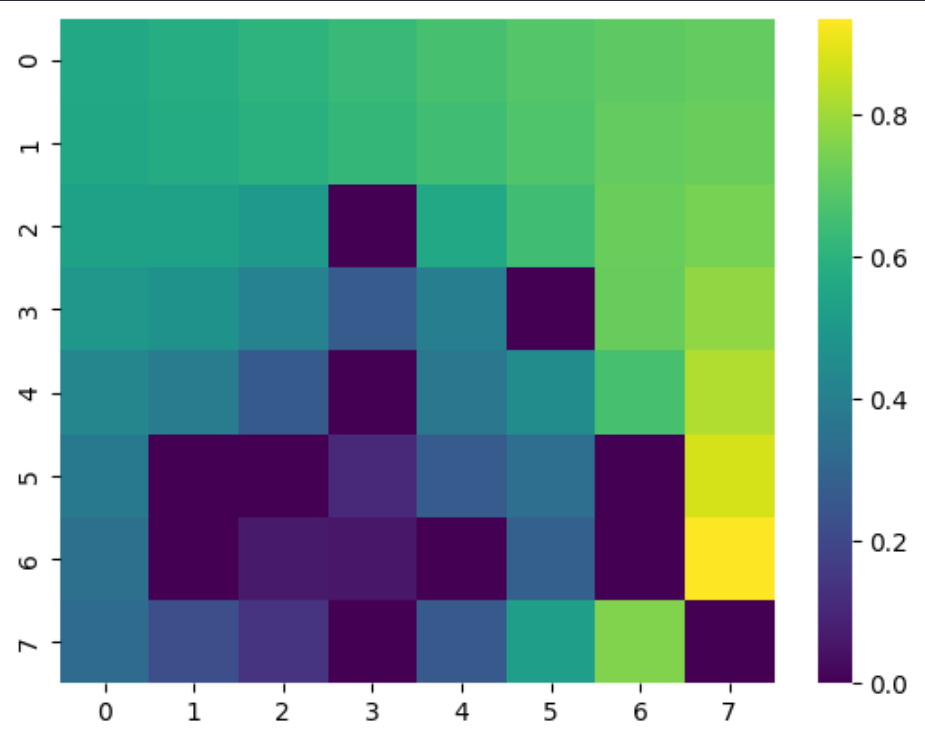

<center></center>

In this article, we'll implement [[Dynamic Programming|Policy Iteration]] in Python to solve a simple problem from the gym library: Frozen Lake.

## ***OpenAI Gym***

The gym library, developed and maintained by OpenAI is one of the most famous libraries for reinforcement learning. It mainly provides game environments that are particularly useful to evaluate and benchmark RL algorithms. Here we take a look at Frozen Lake, a simple environment that could be called the "Hello World" of RL. The goal is simple, the agent has to navigate on grid and collect a treasure. For this, we aim to find the best itinerary to avoid holes and collect the treasure as quickly as possible.

Here are the rules of the game:

* The environment is available as a 4x4 or 8x8 grid.
* The agent always start in the top left corner and can pick 1 out of 4 actions at every time step (move up, down, right or left).
* Here the ***environment dynamics*** are ***known*** and ***deterministic***, moving in a certain direction places the player on the expected square (there also exist a "slippery" version of the game where *p* is stochastic).
* After picking an action, the environment will return an ***observation*** which is an integer representing the agent's position.
* The game ends when the agent finds the treasure or falls into a hole, the environment is then reset (the agent comes back to the initial square)

[Here is the complete documentation.](https://gymnasium.farama.org/environments/toy_text/frozen_lake/#frozen-lake)

## ***Python Implementation***

We start by importing the relevant libraries:

* gym: used to load and interact with the environment
* numpy: used for random choices and mathematical functions
* seaborn and matplotlib: used to visualize the value function

```python
import gym
import numpy as np
import seaborn as sns
import matplotlib.pyplot as plt
```

In order to implement policy iteration, we have to define ***policy evaluation*** and ***policy improvement***. Indeed policy iteration will simply alternate between those two algorithms until an optimal policy and value function are found. Let's start with policy evaluation :

## ***Policy evaluation***

Policy evaluation is an algorithm aiming to ***estimate the value function for the current policy***.
First we start by initializing the value function to 0 for each state. Then we enter the iterative part of the algorithm: for each state, we'll pick the action returned by the policy and ***apply the Bellman equation to update the value function***:
$$V(s) = \sum_a \pi(a|s) \sum_{s'} P[s',r|s,a](r + \gamma V(s'))$$
Once we updated the value function, we check if the value function has converged. To do so, we compare the compute the absolute difference between each term of the updated value function and the old one and compare the maximum to epsilon. If this maximum is still superior to the parameter epsilon, the algorithm is repeated until we reach convergence or the maximum number of iterations.

```python
def policy_evaluation(p, n_states, policy, gamma, epsilon, max_iter=100):
    """
    @p: environment model: p[state][action] returns a tuple (p_transition, next_state, reward, done)
        for each new state s'
    @policy: list containing one action to take in each state
    @gamma: discount factor
    @epsilon: float indicating the tolerance level for policy convergence
    @max_iter: maximum number of iterations before interrupting training
    """

 # initialization
    value_function = np.zeros(n_states)
    error = 1
    n_iter = 0

 # repeat the algorithm until convergence or maximum nummber
 # of iterations
    while error > epsilon and n_iter < max_iter:
     # initialize the new value function
        new_value_function = np.zeros(n_states)
        # sweep through all states
        # pick the policy's action for that state
        # get all the transition probabilities, rewards and subsequent states s'
        # for all transitions, compute the Bellman update for the value function
        for state in range(n_states):
            action = policy[state]
            transitions = p[state][action]
            for transition in transitions:
                prob, s_prime, reward, _ = transition
                new_value_function[state] += prob*(reward + gamma*value_function[s_prime])
        # check for convergence
        # update the value function with and increment the 
        # iteration counter
        error = np.max(np.abs(new_value_function - value_function))
        value_function = new_value_function
        n_iter +=1

 # if the maximum number of iterations is reached, exit the function
    if n_iter > max_iter:
        print("Policy evaluation didn't converge, exiting")
        exit()

    return value_function
```

## ***Policy improvement***

The second part of policy iteration is policy improvement. After having estimated the value function for the current policy, we'll ***improve the policy by greedily selecting actions leading to the highest expected return***. Indeed, we are trying to figure out wether we should ***deterministically choose an action other than the one chosen by the current policy in order to improve it***.
To do so, we ***sweep through all states and available actions*** and ***compute the action value of each  state-action pair*** using the acion value function:
$$q_\pi(s,a) = E[R_{t+1} + \gamma v_\pi(S_{t+1}) | S_t=s, A_t=a)]$$
$$= \sum_{s',r} p[s',r|s,a](r + \gamma v_\pi(s'))$$
After this, we end up selecting the ***action having the highest $q$ value.*** In other words, we consider the new greedy policy $\pi'$ given by:
$$\pi'(s) = arg \max_a q\pi(s,a)$$
$$= arg \max_a \sum_{s',r} p[s',r|s,a](r + \gamma v_\pi(s'))$$
This policy being greedy, it will assign probability 1 to the action yielding the highest $q$ value and 0 to the others. The more we evaluate and improve the policy and value function, the better this greedy action will be, until we reach convergence.

```python
def policy_improvement(p, n_states, n_actions, value_from_policy, gamma):
    """
    @p: environment model: p[state][action] returns a tuple (p_transition, next_state, reward, done)
        for each new state s'
    @value_from_policy: value estimation of each state before policy improvement
    @gamma: discount factor
    """
    
    # initialize the new policy
    new_policy = np.zeros(n_states, dtype=int)

    # iterate through all states and actions
    for state in range(n_states):
        # initialize the q values for each state
        q_values = np.zeros(n_actions)

        for action in range(n_actions):
            transitions = p[state][action]
            for transition in transitions:
                prob, s_prime, reward, done = transition

                # get Vpi for the next state s'
                old_estimate = value_from_policy[s_prime]

                # estimate the q value for the current action
                q_values[action] += prob*(reward + gamma*old_estimate)

        # make the policy greedy with regards to the q values
        best_action = np.argmax(q_values)
        new_policy[state] = best_action

    return new_policy
```

## ***Policy iteration***

Now that we know about policy evaluation and policy improvement, it's time to combine both algorithms in policy iteration.
Policy iteration is repeated until the policy converges, as mentioned in the [[Dynamic Programming|theoretical article about dynamic programming]], ***alternating policy evaluation and policy iteration is guaranteed to improve the policy*** and value function at each step. Therefore, ***when the policy stops changing*** (or its values are ***updated by less than epsilon***), we know that we have obtained an ***optimal policy***.

```python
def policy_iteration(p, n_states, n_actions, gamma, epsilon, max_iter=100):
    """
    @p: environment model: p[state][action] returns a tuple (p_transition, next_state, reward, done)
        for each new state s'
    @gamma: discount factor
    @epsilon: float indicating the tolerance level for policy convergence
    @max_iter: maximum number of iterations before interrupting training
    """

    # initialize the new policy
    value_function = np.zeros(n_states)
    policy = np.zeros(n_states)

    policy_stable = False
    n_iter = 0

    while not policy_stable and n_iter < max_iter:
        # perform policy evaluation and policy improvement
        value_function = policy_evaluation(p, n_states, policy, gamma, epsilon)
        new_policy = policy_improvement(p, n_states, n_actions, value_function, gamma)

        # compare the old and the updated policy
        delta = new_policy - policy
        # if the policy stops improving, i.e. old_policy = new_policy
        # the policy converged and we stop the iteration
        if np.linalg.norm(delta) == 0:
            print("Policy converged!")
            policy_stable = True
        policy = new_policy
        n_iter +=1

    if n_iter == max_iter:
        print("Policy iteration didn't converge, exiting")
        exit()

    return value_function, policy
```

## ***Running the algorithm and plotting the value function***

Now that the policy iteration algorithm is complete, we simply have to load the environment and run the function.

```python
if __name__ == "__main__":
    env = gym.make('FrozenLake8x8-v1')
    env.reset()
    n_states = env.observation_space.n
    n_actions = env.action_space.n
    p = env.P
    n_iter = 0

    value_function, policy = policy_iteration(p, n_states, n_actions,gamma=0.999, epsilon=1e-3)

    print(f'Value function: {value_function}')
    print(f'Policy: {policy}')

    sns.heatmap(pd.DataFrame(value_function.reshape(8,-1)), cmap='viridis')
```

We obtain the following heatmap by plotting the state value function for the 8 by 8 environment.
Remember that the agent starts in the top left corner and that the treasure is in the bottom right corner. We can see that the closer we get to the treasure, the higher the state value, indeed the closer we are to receiving the reward.
Note that the treasure's square has a value of zero, this is simply because this square is a terminal state, meaning that it has no value. The square with the highest reward is the one right above, as being on this square leads to the only action that yields a reward of 1, which is to move downards and collect the treasure.

<center></center>
