*Disclaimer: most of the theoretical parts of this article are based on Reinforcement Learning: an Introduction by Sutton and Barto. It is higly recommended to read or have read up to chapter 8 to better grasp the concepts introduced here.*

*The full code for this experiment is available in the following [GitHub repo](https://github.com/RPegoud/Temporal-Difference-learning/tree/main)*

In this article, we'll compare different kinds of **TD algorithms** in a custom Grid World.
The design of the experiment will outline the importance of **exploration** as well as the individual characteristics of the tested algorithms: **Q-learning**, **Dyna-Q** and **Dyna-Q**+.

## ***The environment***

The environment we'll use in this experiment is a grid world with the following features:

* The grid is **12 by 8** cells, meaning there are **96 states** in total.
* The **agent** starts in the **bottom left** corner of the grid.
* The **objective** is to reach the **treasure** located in the **top right** corner.
* There are different kind of portals:
  * The **blue portals** are **connected**, going through the portal located on the cell **(10, 6)** leads to the cell  **(11, 0)**. The agent cannot take the portal again after its first transition.
  * The **purple portal** only appears **after 100 episodes** but allows to reach the treasure faster.
  * The **red portal** are **traps** (terminal states) and end the episode.
  * The agent starts the episode surrounded by walls, bumping into one of them will result in the agent **remaining in the same state**.

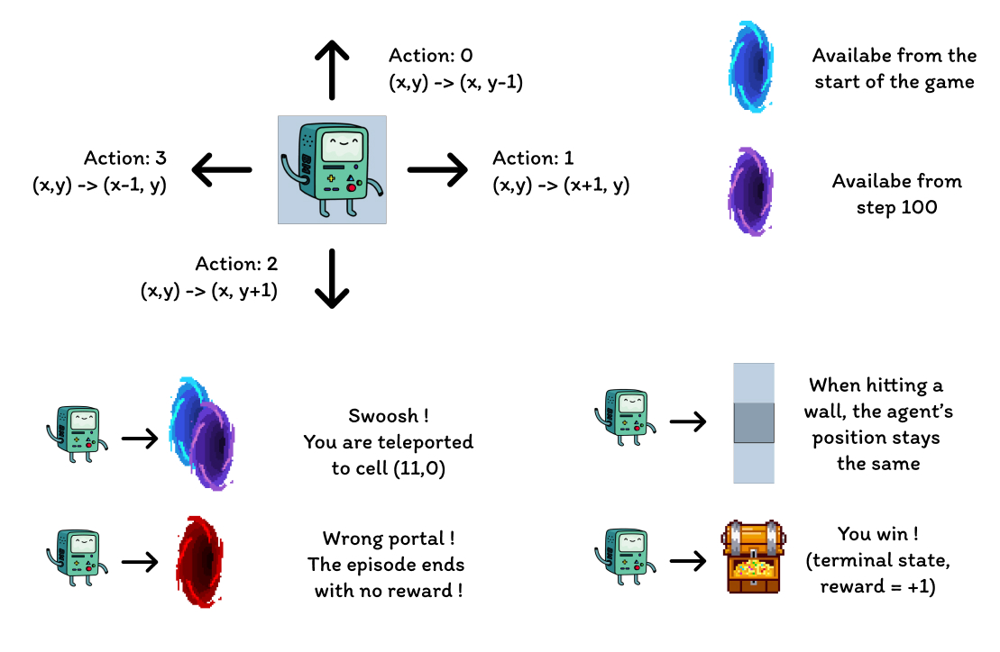

The aim of this experiment is to compare the behavior of the **Q-learning**, **Dyna-Q** and **Dyna-Q+** agents in a changing environment. Indeed, after 100 episodes, the optimal policy is bound to change and the **optimal number of steps** during a successful episode will decrease **from 17 to 12**.

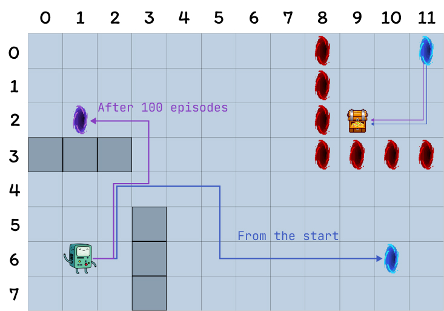

In order to determine the optimal path towards the treasure, we're going to use several **Temporal-Difference Learning algorithms**.

## ***Introduction to Temporal-Difference Learning***

Temporal-Difference Learning (TD learning) is a combination of Monte Carlo (MC) methods and dynamic programming (DP):

* As MC methods, TD methods can **learn from experience** without requiring a **model of the environment's dynamics**.
* Like DP methods, TD methods update **estimates** partly based on **other learned estimates** without waiting for the **final outcome** (this is called *bootstrapping*).

One particularity of TD methods is that they update their value estimate **every time step**, as opposed to MC methods that wait until the end of an episode.
This is due to the different update targets of both methods, where MC methods aim to update the return $G_t$ (only available at the end of an episode), TD methods target $R_{t+1} + \gamma V(S_{t+1})$, where $V$ is an **estimate of the true value function** $v_\pi$.

Therefore, TD methods **combine** the ***sampling*** of MC (by using an estimate $V$ instead of $v_\pi$) and the ***bootstrapping*** of DP (by updating $V$ based on estimates relying on further estimates).

The simplest version of temporal-difference learning is called ***TD(0)*** or *one-step TD*, a practical implementation of TD(0) would look like this for a single episode:

.png)

Put simply, when transitioning from a state $S$ to a new state $S'$, the TD(0) algorithm will compute a backed-up value and update $V(S)$ accordingly. This backed-up value is called ***TD error***, the difference between original estimate of $V(S)$ and a better estimate $R_{t+1} + \gamma V(S_{t+1})$:
$$
\gamma_t \doteq R_{t+1} + \gamma V(S_{t+1}) - V(S_t)
$$

In conclusion, TD methods present several advantages:

* They do not require a perfect model of the enironment dynamics $p$
* They are implemented in an online fashion, updating the target after each time step
* TD(0) is guaranteed to converge for any fixed policy $\pi$ if $\alpha$ follows stochastic approximation conditions (for more detail see page 55 *"Tracking a Nonstationary Problem"* of [RL:An Introduction](http://incompleteideas.net/book/RLbook2020.pdf))

> ## ***Implementation details:***
>
> The following sections explore the main characteristics and performances of several TD algorithms on the grid world.
> The **same parameters** were used **for all models**, for the sake of simplicity:
>
> * **Epsilon = 0.1**: probability of selecting a random action in $\epsilon$-greedy policies
> * **Gamma = 0.9**: discount factor applied to future rewards or value estimates
> * **Step size = 0.25**: learning rate restricting the Q value updates
> * **Planning steps = 100**: for Dyna-Q and Dyna-Q+, the number of planning steps executed for each direct interaction
> * **Kappa = $1^{-3}$**: for Dyna-Q+, the weight of bonus rewards applied during planning steps
>
> The performances of each algorithm is first presented for a single run of 400 episodes (sections: Q-learning, Dyna-Q and Dyna-Q+) and then averaged over 100 runs of 250 episodes in the "summary and algorithms comparison" section.

## ***Q-learning:***

The first algorithm we implement here is the famous Q-learning (*Watkins, 1989*):

$$
Q(S_t, A_t) ← Q(S_t, A_t) + \alpha[R_{t+1} + \gamma \max_a Q(S_{t+1}, a) - Q(S_t, A_t)]
$$
Q-learning is called an **off-policy** algorithm as the goal here is to approximate $q_\star$ instead of $\pi$, the policy followed by the agent. The policy is still used to select which state-action pairs are visited and updated, however all that is required for convergence is that these pairs continue to be updated.

Compared to the previous TD learning pseudo code, there are three main differences:

* We need to **initialize the Q function** for all states and actions and $Q(terminal)$ should be 0
* The actions are chosen from a **policy based on the Q values** (for instance the $ϵ$-greedy policy with respect to the Q values)
* The update targets the **action value function** $Q$ rather than the state value function $V$

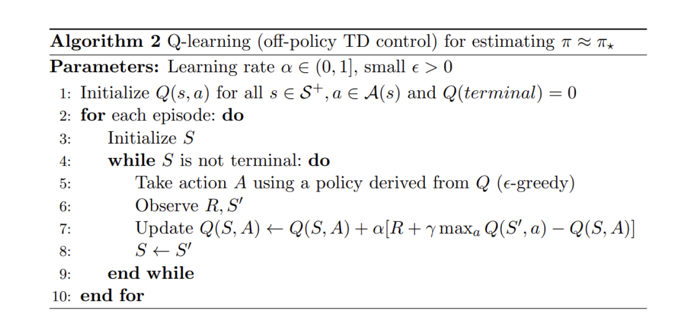

Now that we have our first algorithm reading for testing, we can start the training phase. Our agent will navigate the Grid World using its $\epsilon$-greedy policy, which is **derived from the Q values**. This policy, selects the action with the **highest Q-value** with a probability of (1 - $\epsilon$) and chooses a **random action** with a probability of $\epsilon$. After each action, the agent will update its Q-value estimates.

We can visualize the evolution of estimated maximum action-value $Q(S,a)$ of each cell of the Grid World using a heatmap.
Here the agent plays 400 episodes. As there is only one update per episode, the evolution of the Q values is quite slow and a large part of the states remain unmapped:

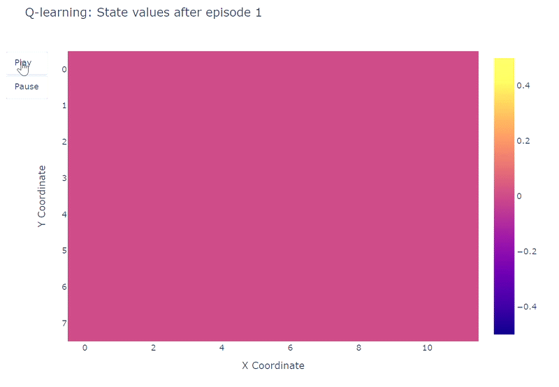

Upon completion of the 400 episodes, an analysis of the total visits to each cell provides us with a decent estimate of the agent's average route. As depicted on the right-hand plot below, the agent seems to have converged to a sub-optimal route, avoiding cell (4,4) and consistently following the lower wall.

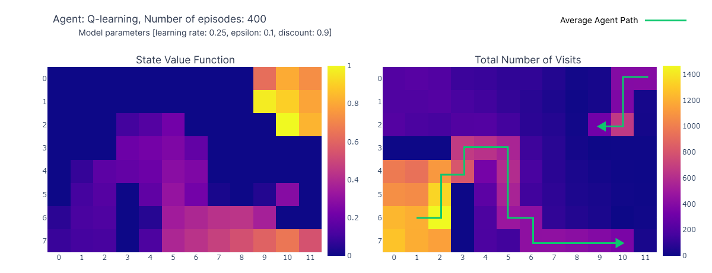

As a result of this sub-optimal strategy, the agent reaches a minimum of **21 steps per episode**, following the path outlined on the "number of total visits" plot. Variations in step counts can be attributed to the $\epsilon$-greedy policy, which introduces a 10% probability of random actions. Given this policy, following the lower wall is a decent strategy to limit potential disruptions caused by random actions.

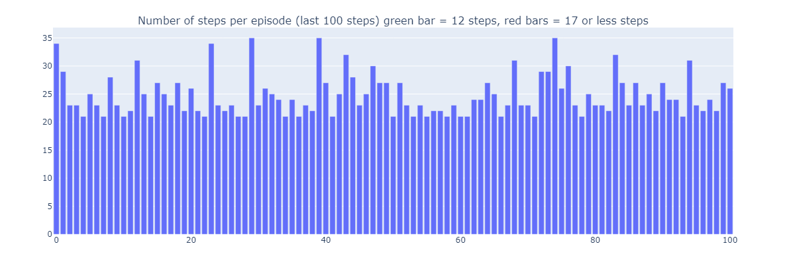

In conclusion, the Q-learning agent converged to a **sub-optimal** strategy as mentioned previously. Moreover, a portion of the environment remains **unexplored by the Q-function**, which prevents the agent from finding the new optimal path when the purple portal appears after the 100th episode.
These performance limitations can be attributed to the relatively **low number of training steps** (400), limiting the possibilities of interaction with the environment and the exploration induced by the $\epsilon$-greedy policy.

***Planning***, an essential component of model-based reinforcement learning methods is particularly useful to improve sample efficiency and estimations of action values. **Dyna-Q** and **Dyna-Q+** are good examples of TD algorithms incorporating planning steps.

## ***Dyna-Q:***

The Dyna-Q algorithm (*Dynamic Q-learning*) is a combination of **model-based RL** and **TD learning**.

Model-based RL algorithms rely on a **model of the environment** to incorporate **planning** as their primary way of updating value estimates. In contrast, model-free algorithms rely on direct learning.

>"*A model of the environment is anything that an agent can use to predict how the environment will respond to its actions" - Reinforcement Learning: an introduction*.

In the scope of this article, the model can be seen as an **approximation** of the **transition dynamics** $p(s',r|s,a)$.
Here, $p$ returns a single next-state and reward pair given a state-action pair.

In environments where $p$ is **stochastic**, we distinguish **distribution models** and **sample models**, the former returns a distribution of next states and actions while the latter returns a single pair, sampled from the estimated distribution.

Models are especially useful to **simulate episodes**, and therefore train the agent by replacing real-world interactions with **planning steps**, interactions with the **simulated environment**.

Agents implementing the Dyna-Q algorithm are part of the class of ***planning agents***, agents that combine **direct reinforcement learning** and **model learning** that is. They use **direct interactions** with the environment to **update their value function** (as in Q-learning) but also to **learn a model of the environment**. After each direct interaction, they can also perform planning steps to update their value function using **simulated interactions**.

> ### Another Chess illustration
>
> Imagine once again playing a good game of chess. After playing each move, the **reaction of your opponent** allows you to **assess the quality of your move**. This is similar to receiving a **positive or negative reward**, which allows you to "**update**" your strategy. If your move leads to a blunder, you probably wouldn't do it again, provided with the same configuration of the board. So far, this is comparable to **direct reinforcement learning**.
>
> Now let's add **planning** to the mix. Imagine that after each of your moves, while the opponent is thinking, you **mentally go back over each of your moves** to **reassess their quality**. You might find weaknesses that you neglected on first sight or find out that a specific move was way better than you thought. These thoughts may also allow you to **update your strategy**. This is exactly what planning is about: **updating** the value function **without interacting with the real environment** but rather a **model** of said environment.

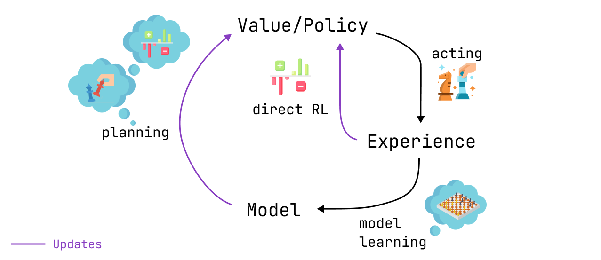

Dyna-Q therefore contains some additional steps compared to Q-learning:

* After each direct update of the Q values, the model **stores** the **state-action pair** and the **reward and next-state** that were observed. This step is called **model training**.
* After model training, Dyna-Q performs **$n$ planning steps**:
  * A random **state-action pair is selected** from the model **buffer** (i.e. this state-action pair was observed during direct interactions)
  * The model **generates** the **simulated reward** and **next-state**
  * The **value function** is **updated** using the **simulated observations** ($s, a, r, s'$)

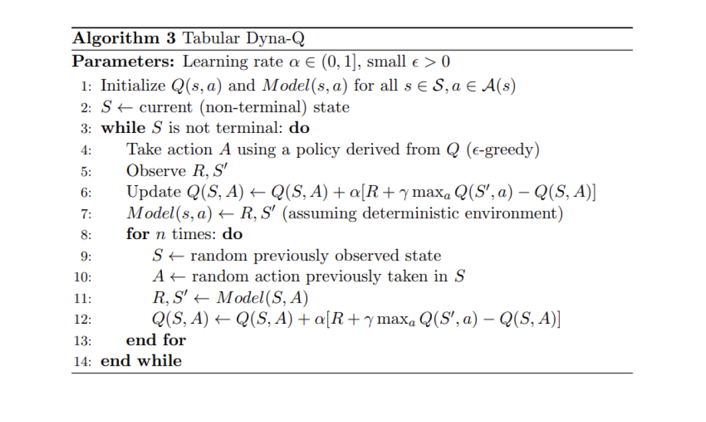

We now replicate the learning process with the Dyna-Q algorithm using $n$=100. This means that **after each direct interaction** with the environment, we use the model to perform **100 planning steps** (i.e. updates).
The following heatmap shows the fast convergence of the Dyna-Q model. In fact, it only takes the algorithm **around 10 steps** to find an **optimal path**. This is due to the fact that every step leads to 101 updates of the Q values (instead of 1 for Q-learning).

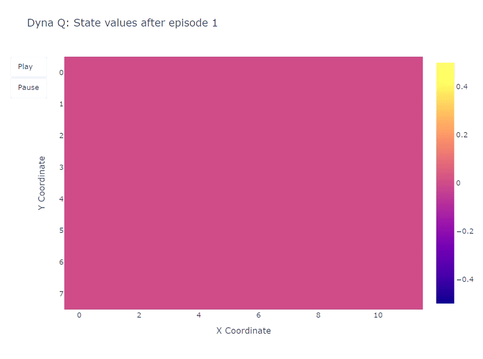

Another benefit of planning steps is a **better estimation** of action values **across the grid**. As the indirect updates target **random transitions** stored inside the model, states that are **far away from the goal** also get **updated**.

In contrast, the action values **slowly propagate from the goal** in Q-learning, leading to an incomplete mapping of the grid.

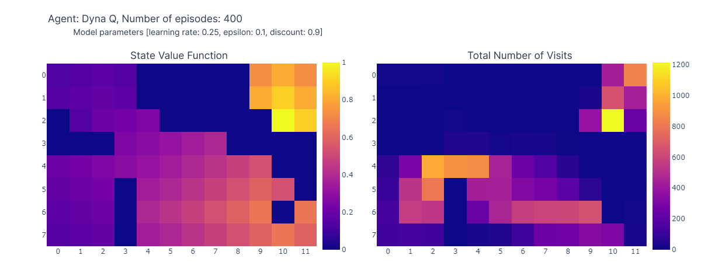

Using Dyna-Q, we find an **optimal path** allowing the resolution of the grid world in **17 steps**, as depicted on the plot below by red bars. Optimal performances are attained **regularly**, despite the occasional interference of $\epsilon$-greedy actions for the sake of exploration.

Finally, while Dyna-Q may appear more convincing than Q-learning due to its incorporation of planning, it's essential to remember that planning introduces a **tradeoff** between **computational costs** and **real-world exploration**.

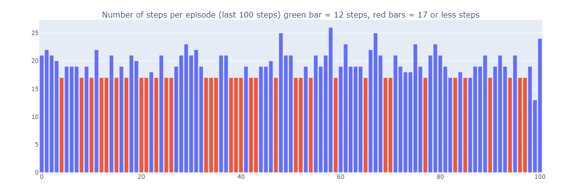

## ***Dyna-Q+***

Up to now, **neither** of the tested algorithms managed to find the **optimal path appearing after step 100** (the purple portal). Indeed, both algorithms rapidly converged to an optimal solution that remained fixed until the end of the training phase. This highlights the **need** for **continuous exploration throughout training**.

Dyna-Q+ is largely similar to Dyna-Q but adds a small twist to the algorithm. Indeed, Dyna-Q+ **cosntantly tracks** the **number of time steps elapsed** since **each state-action pair was tried** in **real** interaction with the environment.
In particular, consider a transition yielding a reward $r$ that has not been tried in $\tau$ time steps. Dyna-Q+ would perform planning as if the reward for this transition was $r + \kappa \sqrt{\tau}$, with $\kappa$ sufficiently small ($10^{-3}$ in the experiment).

This change in reward design encourages the agent to **continually explore the environment**. It assumes that the longer a state-action pair hasn't been tried, the greater the chances that the dynamics of this pair have **changed** or that the **model of it is incorrect**.

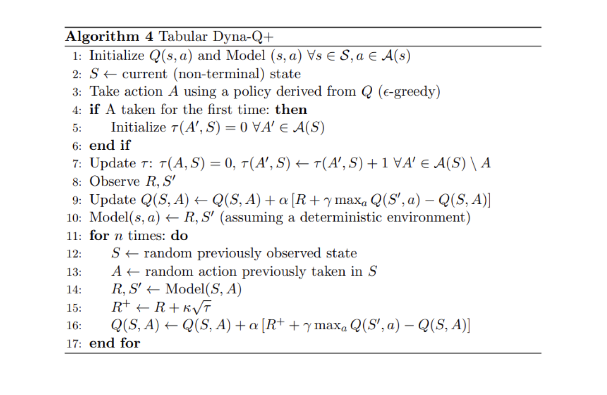

As depicted by the following heatmap, Dyna-Q+ is much more **active** with its updates compared to the previous algorithms. Before episode 100, the agent explores the whole grid and finds the blue portal and the first optimal route.
The action values for the rest of the grid decrease before **slowly increasing again**, as states-action pairs in the top left corner **are not explored for some time**.
As soon as the purple portal appears on episode 100, the agent **finds the new shortcut** and **the value for the whole area rises**. Until completion of the 400 episodes, the agent will continuously update the action value of each state-action pair while maintaining occasional exploration of the grid.

Thanks to the bonus added to model rewards, we finally obtain a **complete mapping of the Q function** (each state or cell has an action value).
Combined to continuous exploration, this allows the agent to find the new best route (i.e. **optimal policy**) as it appears, while retaining the previous solution.

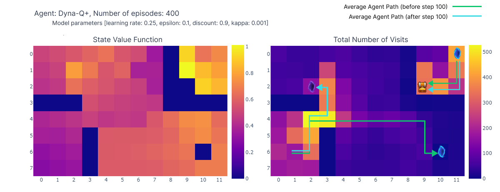

However, the exploration-exploitation trade-off in Dyna-Q+ indeed comes with a cost. When state-action pairs haven't been visited for a sufficient duration, the exploration bonus **encourages the agent to revisit those states**, which can **temporarily decrease its immediate performance**. This exploration behavior prioritizes updating the model to improve **long-term decision-making**.

This explains why some episodes played by Dyna-Q+ can be up to **70 steps long**, compared to at most **35 and 25 steps** for Q-learning and Dyna-Q, respectively. The longer episodes in Dyna-Q+ reflect the agent's willingness to invest extra steps in exploration to gather more information about the environment and refine its model, even if it results in short-term performance reductions.

In contrast, Dyna-Q+ regularly achieves optimal performance (depicted by green bars on the plot below) that previous algorithms did not attain.

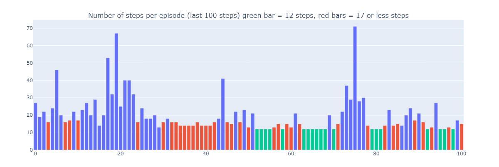

## ***Summary and algorithms comparison***

In order to compare the key differences between the algorithms, we use two metrics (keep in mind that the results depend on the input parameters, that were identical among all models for simplicity):

* The **number of steps per episode**: this metric characterizes the rate of convergence of the algorithms towards an optimal solution. It also describes the behaviour of the algorithm after convergence, particularly in terms of exploration.
* **Average cumulative reward**: the percentage of episodes leading to a positive reward

Analyzing the number of steps per episode (see plot below), reveals several aspects of model-based and model-free methods:

* **Model-Based Efficiency**: Model-based algorithms (Dyna-Q and Dyna-Q+) tend to be more **sample-efficient** in this particular Grid World (this property is also observed more generally in RL). This is because they can plan ahead using the learned model of the environment, which can lead to quicker convergence to near-optimal or optimal solutions.

* **Q-Learning Convergence**: Q-learning, while eventually converging to a near-optimal solution, requires more episodes (125) to do so. It's important to highlight that Q-learning performs only **1 update per step**, which contrasts with the multiple updates performed by Dyna-Q and Dyna-Q+.

* **Multiple Updates**: Dyna-Q and Dyna-Q+ execute **101 updates per step**, which contributes to their faster convergence. However the tradeoff for this sample-efficiency is computational cost (see the runtime section in the table below).

* **Complex Environments**: In more complex or stochastic environments, the advantage of model-based methods might diminish. Models can introduce errors or inaccuracies, which can lead to suboptimal policies. Therefore, this comparison should be seen as an outline of the strengths and weaknesses of different approaches rather than a direct performance comparison.

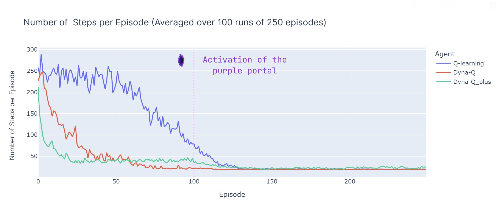

We now introduce the average cumulative reward, which represents the percentage of episodes where the agent reaches the goal (as the reward is 1 for reaching the goal and 0 for triggering a trap), the ACR is then simply by:
$$ACR = {1 \over{N*K}} \sum_{k=0}^K \sum_{n=0}^N{R_{n,k}}$$
With $N$ the number of episodes (250) and K the number of independent runs (100) and $R_{n,k}$ the cumulative reward for episode $n$ in run $k$.

Here's a breakdown of the performance of all algorithms:

* **Dyna-Q** converges rapidly and achieves the highest overall return, with an ACR of **87%**. This means that it efficiently learns and reaches the goal in a significant portion of episodes.

* **Q-learning** also reaches a similar level of performance but requires more episodes to converge, explaining its slightly lower ACR, at **70%**.

* **Dyna-Q**+ promptly finds a good policy, reaching a cumulative reward of 0.8 after only 15 episodes, however the variability and exploration induced by the bonus reward reduces performance until step 100. After 100 steps, it starts to improve as it **discovers the new optimal path**. However, the short-term exploration compromises its performance, resulting in an ACR of **79%**, which is lower than Dyna-Q but higher than Q-learning.

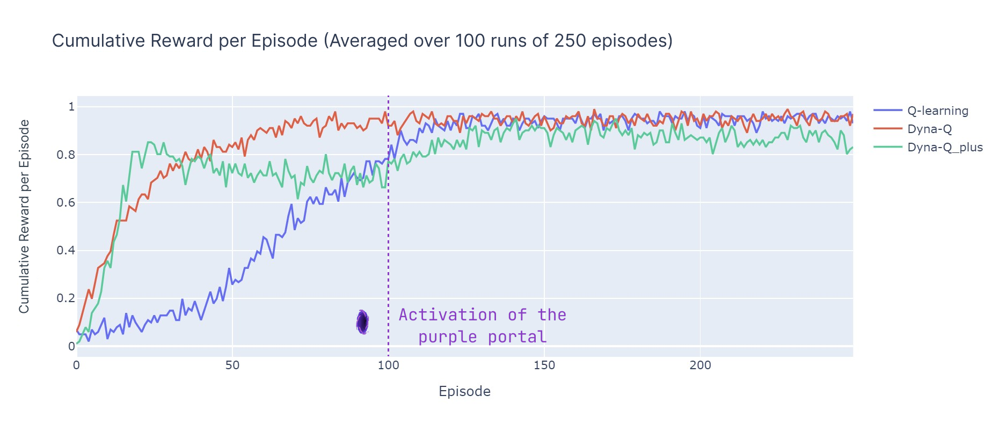

## ***Conclusion***

In this article, we presented the fundamental principles of Temporal Difference learning and applied Q-learning, Dyna-Q and Dyna-Q+ to a custom grid world. The design of this grid world helps emphasize the importance of continual exploration as a way to discover and exploit new optimal policies in changing environments. The difference in performances (evaluated using the number of steps per episode and the cumulative reward) illustrate the strengths and weaknesses of these algorithms.
In summary, model-based methods (Dyna-Q, Dyna-Q+) benefit from increased sample efficiency compared to model-based methods (Q-learning), at the cost of computation efficiency. However, in stochastic or more complex environments, innacuracies in the model could hinder performances and lead to sub-optimal policies.

| Algorithm  | Type        | Updates per step     | Runtime (400 episodes, single CPU) | Discovered optimal strategy (purple portal) | Average cumulative reward |
|:---------- | ----------- | -------------------- |:---------------------------------- | ------------------------------------------- |:------------------------- |
| Q-learning | Model-free  | 1                    | 4.4 sec                            | No                                          | 0.70                      |
| Dyna-Q     | Model-based | 101                  | 31.7 sec                           | No                                          | 0.87                      |
| Dyna-Q+    | Model-based | 101                  | 39.5 sec                           | Yes                                         | 0.79                      |

## ***References***

* ***Reinforcement Learning: An Introduction*** (2018), Richard S. Sutton and Andrew G. Barto, MIT Press, Cambridge, MA
