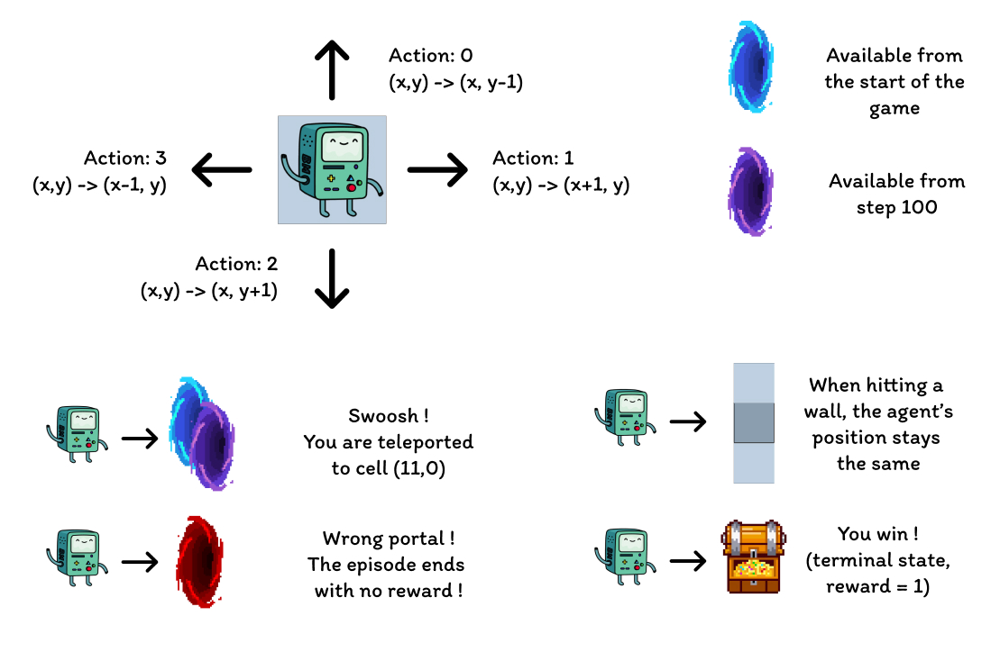
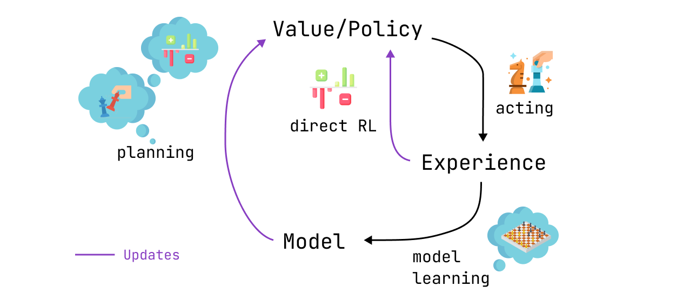

*The full code for this experiment is available in the following [GitHub repo](https://github.com/RPegoud/Temporal-Difference-learning/tree/main)*

<!-- | Algorithm  | Type        | Runtime (400 episodes, 10 runs) | Discovered second optimal strategy |     |
| ---------- | ----------- | ---------------------- | ------------------------ | --- |
| Q-learning | Model-free  | 4 min 03 sec           | No                       |     |
| Dyna-Q     | Model-based | 59 min 03 sec          | No                       |     |
| Dyna-Q+    | Model-based | 48 min 12 sec          | Yes                      |     | -->

In this article, we'll compare different kinds of TD algorithms in a custom Grid World.
The design of the experiment will outline the importance of exploration as well as the individual characteristics of the tested algorithms: **Q-learning**, **Dyna-Q** and **Dyna-Q**+.

## ***The environment***

The environment we'll use in this experiment is a grid world with the following features:

* The grid is **12 by 8** cells, meaning there are **96 states** in total.
* The **agent** starts in the **bottom left** corner of the grid.
* The **objective** is to reach the **treasure** located in the **top right** corner.
* There are different kind of portals:
  * The **blue portals** are **connected**, going through the portal located on the cell **(10, 6)** leads to the cell  **(11, 0)**. The agent cannot take the portal again after its first transition.
  * The **purple portal** only appears **after 100 episodes** but allows to reach the treasure faster.
  * The **red portal** are **traps** (terminal states) and end the episode.
  * The agent starts the episode surrounded by walls, bumping into one of them will result in the agent **remaining in the same state**.

The aim of this experiment is to compare the behavior of the **Q-learning**, **Dyna-Q** and **Dyna-Q+** agents in a changing environment. Indeed, after 100 episodes, the optimal policy is bound to change and the **optimal number of steps** during a successful episode will decrease **from 17 to 12**.

In order to determine the optimal path towards the treasure, we're going to use several **Temporal-Difference Learning algorithms**.

## ***Introduction to Temporal-Difference Learning***

Temporal-Difference Learning (TD learning) is a combination of Monte Carlo (MC) methods and dynamic programming (DP):

* As MC methods, TD methods can learn from experience without requiring a model of the environment's dynamics.
* Like DP methods, TD methods update estimates partly based on other learned estimates without waiting for the final outcome (this is called *bootstrapping*).

One particularity of TD methods is that they update their value estimate every time step, as opposed to MC methods that wait until the end of an episode.
This is due to the different update targets of both methods, where MC methods aim to update the return $G_t$ (only available at the end of an episode), TD methods target $R_{t+1} + \gamma V(S_{t+1})$, where $V$ is an estimate of the true value function $v_\pi$.

Therefore, TD methods **combine** the ***sampling*** of MC (by using an estimate $V$ instead of $v_\pi$) and the ***bootstrapping*** of DP (by updating $V$ based on estimates relying on further estimates).

The simplest version of temporal-difference learning is called ***TD(0)*** or *one-step TD*, a practical implementation of TD(0) would look like this for a single episode:

.png)

Put simply, when transitioning from a state $S$ to a new state $S'$, the TD(0) algorithm will compute a backed-up value and update $V(S)$ accordingly. This backed-up value is called ***TD error***, the difference between original estimate of $V(S)$ and a better estimate $R_{t+1} + \gamma V(S_{t+1})$:
$$
\gamma_t \doteq R_{t+1} + \gamma V(S_{t+1}) - V(S_t)
$$

In conclusion, TD methods present several advantages:

* They do not require a perfect model of the enironment dynamics $p$
* They are implemented in an online fashion, updating the target after each time step
* TD(0) is guaranteed to converge for any fixed policy $\pi$ if $\alpha$ follows stochastic approximation conditions (for more detail see page 55 *"Tracking a Nonstationary Problem"* of [RL:An Introduction](http://incompleteideas.net/book/RLbook2020.pdf))

## ***Q-learning:***

The first algorithm we implement here is the famous Q-learning algoirthm (*Watkins, 1989*):

$$
Q(S_t, A_t) ← Q(S_t, A_t) + \alpha[R_{t+1} + \gamma \max_a Q(S_{t+1}, a) - Q(S_t, A_t)]
$$
Q-learning is called an **off-policy** algorithm as the goal here is to approximate $q_\star$ instead of $\pi$, the policy followed by the agent. The policy is still used to select which state-action pairs are visited and updated, however all that is required for convergence is that these pairs continue to be updated.

Compared to the previous TD learning pseudo code, there are three main differences:

* We need to initialize the Q function for all states and actions and $Q(terminal)$ should be 0
* The actions are chosen from a policy based on the Q values (for instance the $ϵ$-greedy policy with respect to the Q values)
* The update targets the action value function $Q$ rather than the state value function $V$

Now that we have our first algorithm to test, we can start the training phase. Our agent will navigate the Grid World using its $\epsilon$-greedy policy, which is derived from the Q values. This policy, selects the action with the highest Q-value with a probability of (1 - $\epsilon$) and chooses a random action with a probability of $\epsilon$. After each action, the agent will update its Q-value estimates.

We can visualize the evolution of estimated maximum action-value $Q(S,a)$ of each cell of the Grid World using a heatmap.
Here the agent plays 400 episodes:

Upon completion of the 400 episodes, an analysis of the total visits to each cell provides us with a decent estimate of the agent's average route. As depicted on the right-hand plot below, the agent seems to have converged to a sub-optimal route, avoiding cell (4,4) and consistently following the lower wall.

As a result of this sub-optimal strategy, the agent reaches a minimum of 21 steps per episode, following the path outlined on the "number of total visits" plot. Variations in step counts can be attributed to the ϵ-greedy policy, which introduces a 10% probability of random actions. Given this policy, following the lower wall is a decent strategy to limit potential disruptions caused by random actions.

In conclusion, the Q-learning agent converged to a sub-optimal strategy as mentioned previously. Moreover, a portion of the environment remains unexplored by the Q-function, which prevents the agent from finding the new optimal path when the purple portal appears after the 100th episode.
These performance limitations can be attributed to the relatively low number of training steps (400), limiting the possibilities of interaction with the environment and the exploration induced by the $\epsilon$-greedy policy.

***Planning***, an essential component of model-based reinforcement learning methods is particularly useful to improve sample efficiency and estimations of action values. **Dyna-Q** and **Dyna-Q+** are good examples of TD algorithms incorporating planning steps.

## ***Dyna-Q:***

The Dyna-Q algorithm (*Dynamic Q-learning*) is a combination of **model-based RL** and **TD learning**.

Model-based RL algorithms rely on a **model of the environment** to incorporate **planning** as their primary way of updating value estimates. In contrast, model-free algorithms rely on direct learning.

>"*A model of the environment is anything that an agent can use to predict how the environment will respond to its actions" - Reinforcement Learning: an introduction*.

In the scope of this article, the model can be seen as an **approximation** of the **transition dynamics** $p(s',r|s,a)$.
Here, $p$ returns a single next-state and reward pair given a state-action pair.

In environments where $p$ is **stochastic**, we distinguish **distribution models** and **sample models**, the former returns a distribution of next states and actions whild the latter returns a single pair, sampled from the estimated distribution.

Models are especially useful to **simulate episodes**, and therefore train the agent by replacing real-world interactions (also called **direct RL**) with **planning steps**, interactions with the **simulated environment**.

## ***Dyna-Q+***

## References

* Smith, J. (2010). The Art of Markdown. Markdown Publishing.
* Johnson, A. (2015). Mastering Citations. Academic Press.
