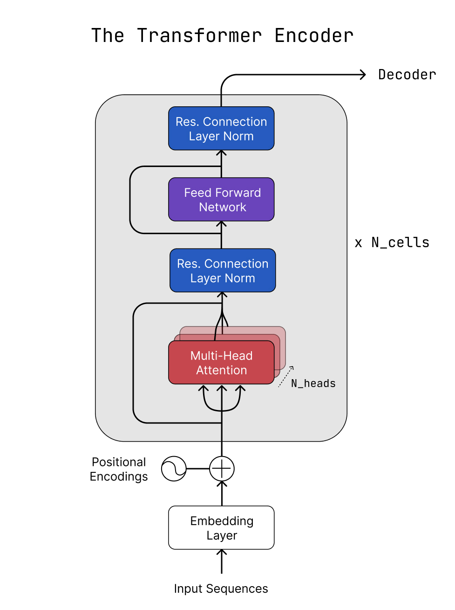
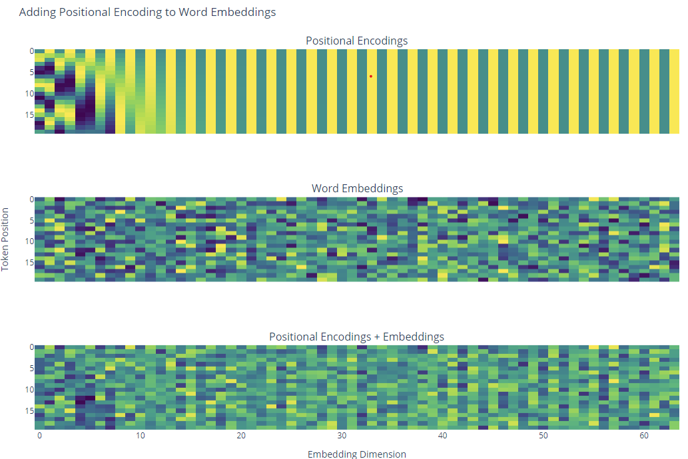
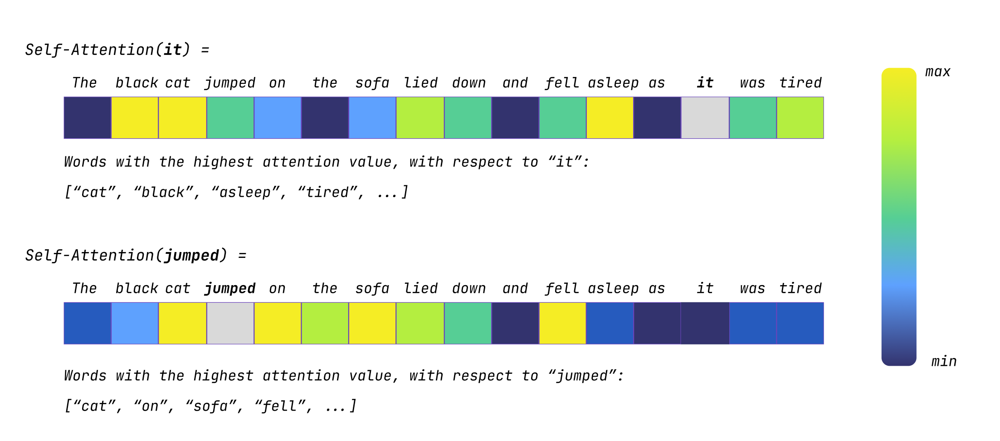
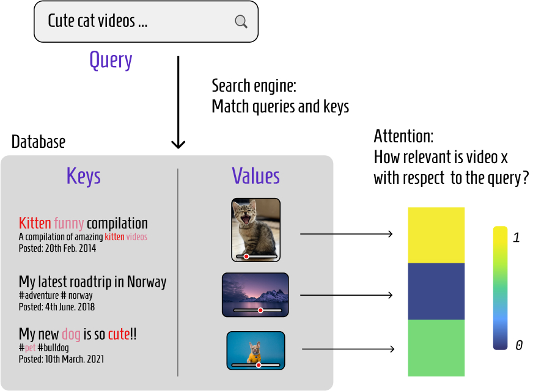
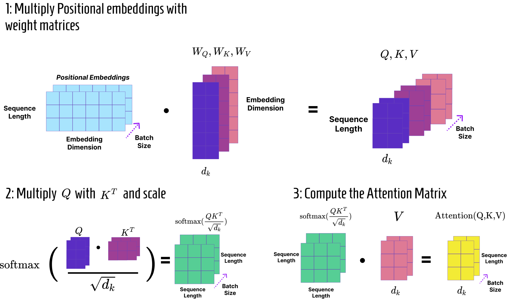
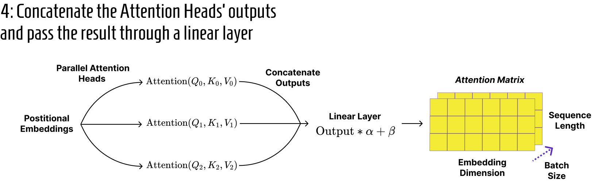
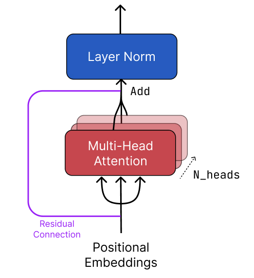
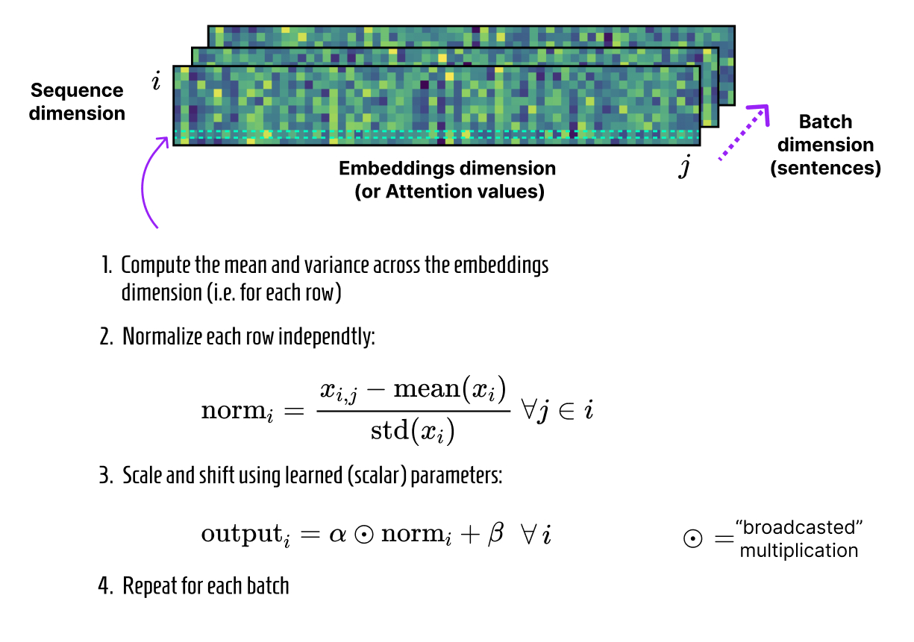

> 🥳 ***This article got published on Towards Data Science  !*** If you enjoy it, feel free to follow me on Medium and upvote the article [here](https://medium.com/towards-data-science/vectorize-and-parallelize-rl-environments-with-jax-q-learning-at-the-speed-of-light-49d07373adf5), thank you and have a  nice read ! 🥳

ntroduced in 2017 in the seminal paper ***“Attention is all you need”***[0], the Transformer architecture is arguably one of the most impactful breakthroughs in recent Deep Learning history, enabling the rise of large language models and even finding use in fields such as computer vision.

Succeeding to former state-of-the-art architectures relying on **recurrence** such as Long Short-Term Memory (**LSTM**) networks or Gated Recurrent **Units** (GRU), **Transformers** introduce the concept of **self-attention**, coupled with an **encoder/decoder** architecture.

In this article, we’ll implement the first half of a Transformer, the **Encoder**, from scratch and step by step. We’ll use **JAX** as our main framework along with **Haiku**, one of DeepMind’s deep learning libraries.

In case you are unfamiliar with JAX or need a fresh reminder about its amazing functionalities, I’ve already covered the topic in the context of Reinforcement Learning in my [**previous article**](https://towardsdatascience.com/vectorize-and-parallelize-rl-environments-with-jax-q-learning-at-the-speed-of-light-49d07373adf5):

We’ll go over each of the blocks that make up the encoder and learn to implement them efficiently. In particular, the outline of this article contains:

* The **Embedding Layer** and **Positional Encodings**
* **Multi-Head Attention**
* **Residual Connections** and **Layer Normalization**
* **Position-wise Feed-Forward Networks**

*Disclaimer: this article is not intended to be a complete introduction to these notions as we’ll focus on implementation first. If needed, please refer to the resources at the end of this post.*

As always, the fully commented code for this article as well as illustrated notebooks are available on **GitHub**, feel free to star the repository if you enjoyed the article!

<div align="center">
  <a href="https://github.com/rpegoud/jab">
    
  </a>
</div>

---

## Main parameters

Before we get started, we need to define a few parameters that will play a crucial role in the encoder block:

* **Sequence Length** (`seq_len`): The number of tokens or words in a sequence.
* **Embedding Dimension** (`embed_dim`): The dimension of the embeddings, in other words, the number of numerical values used to describe a single token or word.
* **Batch Size** (`batch_size`): The size of a batch of inputs, i.e. the number of sequences processed at the same time.
The input sequences to our encoder model will typically be of shape (`batch_size`, `seq_len`). In this article, we’ll use `batch_size`=32 and `seq_len`=10, which means that our encoder will simultaneously process 32 sequences of 10 words.

Paying attention to the shape of our data at each step of the processing will enable us to better visualize and understand how the data flows in the encoder block. Here’s a high-level overview of our encoder, we’ll start from the bottom with the **embedding layer** and **positional encodings**:



## Embedding Layer and Positional Encodings

As mentioned previously, our model takes batched sequences of tokens as inputs. Generating those tokens could be as simple as collecting a set of unique words in our dataset, and assigning an index to each of them. Then we would sample **32 sequences** of **10 words** and replace each word with its index in the vocabulary. This procedure would provide us with an array of shape (`batch_size`, `seq_len`), as expected.

We are now ready to get started with our Encoder. The first step is to create ***“positional embeddings”*** for our sequences. Positional embeddings are the **sum** of **word embeddings** and **positional encodings**.

### Word Embeddings

Word embeddings allow us to encode the **meaning** and **semantic relations between words** in our vocabulary. In this article, the embedding dimension is fixed to **64**. This means that each word is represented by a **64-dimensional vector** so that words with similar meanings have similar coordinates. Moreover, we can manipulate these vectors to **extract relations between words**, as depicted below.

<div align="center">
  
</div>

Using Haiku, generating learnable embeddings is as simple as calling:

```python
hk.Embed(vocab_size, embed_dim)
```

These embeddings will be updated along with other learnable parameters during model training (*more on that in a second*).

### Positional Encodings

As opposed to recurrent neural nets, Transformers can’t infer the position of a token given a shared hidden state as they **lack recurrent** or **convolutional structures**. Hence the introduction of **positional encodings, vectors** that convey a **token’s position** in the **input sequence**.

Essentially, each token is assigned a **positional vector** composed of **alternating sine and cosine values**. Those vectors match the dimensionality of word embeddings so that both can be summed.

In particular, the original Transformer paper (*Vaswani et al. 2017*) uses the following functions:

$$PE_{pos, 2i} = sin(pos/10000^{2i / d_{model}})$$
$$PE_{pos, 2i+1} = cos(pos/10000^{2i / d_{model}})$$

The below figures enable us to further understand the functioning of positional encodings. Let’s take a look at the first row of the uppermost plot, we can see **alternating sequences of zeros and ones**. Indeed, rows represent the position of a token in the sequence (the `pos` variable) while columns represent the embedding dimension (the `i` variable).

Therefore, when `pos=0,`the previous equations return `sin(0)=0` for even embedding dimensions and `cos(0)=1` for odd dimensions.

Moreover, we see that adjacent rows share similar values, whereas the first and last rows are wildly different. This property is helpful for the model to assess the **distance between words** in the sequence as well as their **ordering**.

Finally, the third plot represents the sum of positional encodings and embeddings, which is the output of the embedding block.



Using Haiku, we define the embedding layer as follows. Similarly to other deep learning frameworks, Haiku allows us to define custom modules (here `hk.Module`) to **store learnable parameters** and **define the behavior** of our model’s components.

Each Haiku module needs to have an `__init__` and `__call__function`. Here, the call function simply computes the embeddings using the `hk.Embed` function and the positional encodings, before summing them.

The positional encoding function uses JAX functionalities such as `vmap` and `lax.cond` for performance. If you are unfamiliar with those functions, feel free to check out my [previous post](https://towardsdatascience.com/vectorize-and-parallelize-rl-environments-with-jax-q-learning-at-the-speed-of-light-49d07373adf5) where they are presented more in-depth.

Put simply, `vmap` allows us to define a function for a **single sample** and **vectorize it** so that it can be applied to **batches** of data. The `in_axes` parameter is used to specify that we want to iterate over the first axis of the ``dim`` input, which is the embedding dimension. On the other hand, ``lax.cond`` is an XLA-compatible version of a Python if/else statement.

<script src="https://gist.github.com/RPegoud/262b0976bfd67ae87d4dafb0661afe72.js"></script>

## Self-attention and MultiHead-Attention

Attention aims to compute the **importance of each word in a sequence**, **relative to an input word**. For example, in the sentence:

> “The black cat jumped on the sofa, lied down and fell asleep, as it was tired”.

The word “**it**” could be quite ambiguous for the model, as *technically*, it could refer to both “**cat**” and “**sofa**”. A well-trained attention model would be able to understand that “**it**” refers to “**cat**” and therefore assign attention values to the rest of the sentence accordingly.

Essentially, **attention values** could be seen as **weights** that describe the **importance** of a certain word **given the context of the input word**. For instance, the attention vector for the word “**jumped**” would have high values for words like “**cat**” (what jumped?), “**on**”, and “**sofa**” (where did it jump?) as these words are **relevant to its context**.



In the Transformer paper, attention is computed using ***Scaled Dot-Product Attention***. Which is summarized by the formula:

$$\text{Attention}(Q,K,V)=\text{softmax}({{QK^T}\over{\sqrt{d_k}}})V$$

Here, Q,K and V stand for ***Queries***, ***Keys*** and ***Values***. These matrices are obtained by multiplying learned weight vectors WQ, WK and WV with positional embeddings.

These names are mainly **abstractions** used to help understand how the information is processed and weighted in the attention block. They are an allusion to **retrieval systems** vocabulary[2] (e.g. searching a video on YouTube for instance).

Here’s an **intuitive** explanation:

* **Queries**: They can be interpreted as a “set of questions” about all the positions in a sequence. For instance, interrogating the context of a word and trying to identify the most relevant parts of the sequence.
* **Keys**: They can be seen as holding information that the queries interact with, the compatibility between a query and a key determines how much attention the query should pay to the corresponding value.
* **Values**: Matching keys and queries allows us to decide which keys are relevant, values are the actual content paired with the keys.

In the following figure, the query is a YouTube search, the keys are the video descriptions and metadata, while the value are the associated videos.



In our case, queries, keys, and values come from the **same source** (as they’re derived from the input sequences), hence the name **self-attention**.

The computation of attention scores is usually executed **multiple times in parallel**, each time with a **fraction of the embeddings**. This mechanism is called “**Multi-Head Attention**” and enables each head to learn several different representations of the data in parallel, leading to a more **robust** model.

A single attention head would generally process arrays with shape (``batch_size, seq_len, d_k``) where ``d_k`` can be set as the ratio between the number of heads and the dimension of the embeddings (``d_k = n_heads/embed_dim``). This way, concatenating the outputs of each head conveniently gives an array with shape (``batch_size, seq_len, embed_dim``), as the input.

The computation of attention matrices can be broken down into several steps:

* First, we define **learnable weight vectors** WQ, WK, and WV. These vectors have shapes (``n_heads, embed_dim, d_k``).
* In parallel, we **multiply** the **positional embeddings** with the **weight vectors**. We obtain Q, K, and V matrices with shapes (``batch_size, seq_len, d_k``).
* We then **scale** the **dot-product** of Q and K (transposed). This scaling involves dividing the result of the dot-product by the square root of ``d_k`` and applying the softmax function on the matrices rows. Therefore, attention scores for an input token (i.e. a row) sum up to one, this helps prevent values from becoming too large and slowing down computation. The output has shape (``batch_size, seq_len, seq_len``)
* Finally, we dot the result of the previous operation with V, making the shape of the output (``batch_size, seq_len, d_k``).



* The outputs of each attention head can then be **concatenated** to form a matrix with shape (``batch_size, seq_len, embed_dim``). The Transformer paper also adds a **linear layer** at the end of the multi-head attention module, to **aggregate** and **combine** the learned representations from **all the attention heads**.



In Haiku, the Multi-Head Attention module can be implemented as follows. The ``__call__`` function follows the same logic as the above graph while the class methods take advantage of JAX utilities such as ``vmap`` (to vectorize our operations over the different attention heads and matrices) and ``tree_map`` (to map matrix dot-products over weight vectors).

<script src="https://gist.github.com/RPegoud/25e43833324013533e00542ffce36ef1.js"></script>

## Residual Connections and Layer Normalization

As you might have noticed on the Transformer graph, the multi-head attention block and the feed-forward net are followed by **residual connections** and **layer normalization**.

### Residual or skip connections

Residual connections are a standard solution to **solve** the **vanishing gradient problem**, which occurs when gradients become too small to effectively update the model’s parameters.

As this issue naturally arises in particularly deep architectures, residual connections are used in a variety of complex models such as **ResNet** (*Kaiming et al, 2015*) in computer vision, **AlphaZero** (*Silver et al, 2017*) in reinforcement learning, and of course, **Transformers**.

In practice, residual connections simply forward the output of a specific layer to a following one, **skipping one or more layers** on the way. For instance, the residual connection around the multi-head attention is equivalent to summing the output of multi-head attention with positional embeddings.

This enables gradients to flow more efficiently through the architecture during backpropagation and can usually lead to **faster convergence** and more **stable training**.



## Layer Normalization

Layer normalization helps ensure that the values propagated through the model do not ***“explode”*** (tend toward infinity), which could easily happen in attention blocks, where several matrices are multiplied during each forward pass.

Unlike batch normalization, which normalizes across the batch dimension assuming a uniform distribution, **layer normalization operates across the features**. This approach is suitable for sentence batches where each may have **unique distributions** due to **varying meanings** and **vocabularies**.

By normalizing across **features**, such as **embeddings** or **attention values**, layer normalization **standardizes data** to a consistent scale **without conflating distinct sentence characteristics**, maintaining the unique distribution of each.



The implementation of layer normalization is pretty straightforward, we initialize the learnable parameters alpha and beta and normalize along the desired feature axis.

<script src="https://gist.github.com/RPegoud/551444561cb470036fa0fd9e19a71e0e.js"></script>

## Position-wise Feed-Forward Network

The last component of the encoder that we need to cover is the **position-wise feed-forward network**. This fully connected network takes the normalized outputs of the attention block as inputs and is used to introduce **non-linearity** and increase the **model’s capacity** to learn complex functions.

It is composed of two dense layers separated by a gelu activation:

<script src="https://gist.github.com/RPegoud/79af8c7d2a5e29496e8a30f505ee62e3.js"></script>

After this block, we have another residual connection and layer normalization to complete the encoder.

## Wrapping up

There we have it! By now you should be familiar with the main concepts of the Transformer encoder. Here’s the full encoder class, notice that in Haiku, we assign a name to each layer, so that learnable parameters are separated and easy to access. The ``__call__`` function provides a good summary of the different steps of our encoder:

<script src="https://gist.github.com/RPegoud/1fce837a559c691c0dbdec104b173018.js"></script>

To use this module on actual data, we have to apply ``hk.transform`` to a function encapsulating the encoder class. Indeed, you might remember that JAX embraces the **functional programming** paradigm, therefore, Haiku follows the same principles.

We define a function containing an instance of the encoder class and return the output of a forward pass. Applying ``hk.transform`` returns a transformed object having access to two functions: ``init`` and ``apply``.

The former enables us to initialize the module with a random key as well as some dummy data (notice that here we pass an array of zeros with shape ``batch_size, seq_len``) while the latter allows us to process real data.

<script src="https://gist.github.com/RPegoud/4f6fb58246b370a5b70e5b859b8a048d.js"></script>

```python
# Note: the two following syntaxes are equivalent
# 1: Using transform as a class decorator
@hk.transform
def encoder(x):
  ...
  return model(x) 
 
encoder.init(...)
encoder.apply(...)

# 2: Applying transfom separately
def encoder(x):
  ...
  return model(x)

encoder_fn = hk.transform(encoder)
encoder_fn.init(...)
encoder_fn.apply(...)
```

In the next article, we’ll **complete the transformer** architecture by adding a **decoder**, which reuses most of the blocks we introduced so far, and learn how to **train a model** on a specific task using **Optax**!

## Conclusion

**Thank you for reading this far**, if you are interested in dabbling with the code, you can find it fully commented on GitHub, along with additional details and a walkthrough using a toy dataset.

<div align="center">
  <a href="https://github.com/rpegoud/jab">
    
  </a>
</div>

If you’d like to dig deeper into Transformers, the following section contains some articles that helped me redact this article.

Until next time 👋

References and Resources:

* [1] [Attention is all you need](https://arxiv.org/pdf/1706.03762.pdf) (2017), Vaswani et al, Google

* [2] [What exactly are keys, queries, and values in attention mechanisms?](https://stats.stackexchange.com/questions/421935/what-exactly-are-keys-queries-and-values-in-attention-mechanisms) (2019) Stack Exchange

* [3] [The Illustrated Transformer](http://jalammar.github.io/illustrated-transformer/) (2018), Jay Alammar

* [4] [A Gentle Introduction to Positional Encoding in Transformer Models](https://machinelearningmastery.com/a-gentle-introduction-to-positional-encoding-in-transformer-models-part-1/) (2023), Mehreen Saeed, Machine Learning Mastery

* [JAX documentation](https://jax.readthedocs.io/en/latest/index.html)
* [Haiku documentation](https://dm-haiku.readthedocs.io/en/latest/notebooks/basics.html)
